**	本项目基于开源项目MyBlog**

# AtonBlog

## 获取MyBlog[源码](https://github.com/ZHENFENG13/My-Blog) 部署运行。 

进入后先修改*application.properties*


运行

1. idea直接启动

2. 在Terminal 输入 mvn spring-boot:run

3. mvn clean package -Dmaven.test.skip -true

   java -jar xxxx.jar

> 第三种方法注意  clean 清除原有打包文件
>
> package 对项目打包
>
> -Dmaven.test.skip -true 跳过测试
>
> 


## 后台管理系统

### 项目整体架构


### 新建工程

使用Spring Initializer这里我只勾选了SpringWeb 

后续需要再自行添加


搭建目录结构


### 登陆功能模块

#### 数据库建立

> MyBlog项目中使用的是逆向工程
>
> 但是本着练习的目的 我决定登陆模块自己完成 之后字段较多的模块再练习逆向工程。

从数据库设计开始（顺便练习一下mysql）

```mysql
create database aton_blog_db;

create table tb_admin_user(
admin_user_id int(11) not null auto_increment comment'管理员Id',
login_user_name VARCHAR(50) not null COMMENT'管理员登陆名称',
login_password VARCHAR(50) not null COMMENT'管理员登陆面',
nick_name VARCHAR(50) not null COMMENT'管理员显示昵称',
locked tinyint(4) default '0' COMMENT'是否锁定 0未锁定 1已锁定无法登陆',
PRIMARY key(admin_user_id)
);

```

> tinyint 属于整数类型 （1byte）
> **“本质上tinyint(1)和tinyint(4)在存储上都是占用1个字节,通常使用tinyint(1)存取Boolean值,使用tinyint(4)存储数字格式的数据。”**
>
> 
>
>  一不小心百度了一下 居然还有这个说法 

然后是插入数据


啊这 加盐了 那就算了吧。

#### Dao层

##### 连接测试

1. 导入Mybatis依赖

```xml
<!-- https://mvnrepository.com/artifact/org.mybatis.spring.boot/mybatis-spring-boot-starter -->
<dependency>
   <groupId>org.mybatis.spring.boot</groupId>
   <artifactId>mybatis-spring-boot-starter</artifactId>
   <version>2.2.2</version>
</dependency>
```

2. 在配置数据库信息

```yaml
spring:
  datasource:
    password: 123456
    username: root
    url: jdbc:mysql://localhost:3306/aton_blog_db
    driver-class-name: com.mysql.cj.jdbc.Driver
```

> 此处driver-class-name报错 肯定是没导包

```xml
		<dependency>
            <groupId>mysql</groupId>
            <artifactId>mysql-connector-java</artifactId>
            <version>8.0.28</version>
        </dependency>
```

3. 小测一下

在test中建立同等目录级别的test目录


~~好家伙 然后呢？ 全忘了~~

翻阅旧代码照着敲一边


###### **问题一：DataSource无法自动注入**

emmmm 这又不能自动注入了

尝试了网上添加jpa依赖或jdbc依赖等方法后仍旧无效

于是**降版本**


> spring组件的版本控制交给了这个父类pom表
>
> 因此修改这里的version就好了  2.7.2-->2.6.7

记得添加@Test注释

SpringBoot 2.2.0版本后引入了Junit5 

所以这里没有添加Junit5依赖 却可以直接使用@Test


##### 创建实体类

自己对着数据库字段敲

idea alt+insert yyds


更懒就直接用idea database插件生成

##### 编写对应Dao层的接口

在写具体业务之前 得先取个名字对吧

要先构思好整体的服务 才方便之后的sql语句编写

> 登陆功能需要哪些接口呢？
>
> 1.没用账号 需要注册 因此需要addUser（有点属性可以为空 所以sql语句需要变化 因此有了Selective）
>
> ​	返回值呢只需要告知成功与否所以是int
>
> 2.登陆需要比对数据库 因此把用户名和密码传入后进行比对，而网页需要根据用户信息进行相应的动态显示 	所以返回值是User类型
>
> 而对于这个用户数据库而言 自然还有查找与更新。（这是其他模块所需要的）


> @Param参数用于指定参数名字。就是在XXXmapper.xml中使用#｛｝读取参数的名字。
>
> 
>
> 过去 面对多参数时 @Param必须要填 否则在xml中使用arg1和arg2表示参数的 可读性差
>
> 而springboot项目中却出现了多个参数不需要@Param
>
> 
>
> > 这里给参数配置@param注解后，Mybatis会自动将参数封装成Map类型，而@param注解的值会成为Map中的key，因此在sql中可以通过配置的注解值来使用参数。
>
> 有关[@Param的更多](blog.csdn.net/qq_21040559/article/details/109105301?utm_medium=distribute.pc_relevant.none-task-blog-2~default~baidujs_baidulandingword~default-1-109105301-blog-84261662.pc_relevant_multi_platform_whitelistv3&spm=1001.2101.3001.4242.2&utm_relevant_index=4)
>
> 

##### mapper

在这之前 在applicaiton.yaml中先配置一下mybatis的扫描包 别名之类的


然后就是sql语句的编写了


#### Service层

##### 编写接口

* 基本照搬Dao层接口 
* 把int类型返还改为布尔值


##### 编写实现类

* 将int类型转变为相应的boolean

* 利用Autowired或Resource自动注入Dao接口对象（二者有何区别？）
* 对参数进行判空 并调用相应的Dao层方法
* 对密码进行加密（MD5Util）


> [@Autowired注解与@Resource注解的区别](https://blog.csdn.net/lhc66666/article/details/124120349)
>
> Autowired由spring提供 若要实现自动注入自然需要将目标加入到Spring容器中（即@Repository）
>
> * 默认ByType
> * 存在多个Bean时搭配Quilifier（当一个接口存在多个实现类时 Quilifier可以指定注入哪个实体类的bean）
>
> Resource由J2EE提供
>
> * 默认ByName
> * 具有Name属性 如：@Resource（name=“userServiceImpl01”）

***

###### 																																																							[MD5介绍](D:\Typro笔记\Code\Java\SpringBoot项目\MD5相关.md)

***

​																											[Equals与==](D:\Typro笔记\Code\Java\SE\常见问题\Equals和==.md)

***


实现类：完成对密码的加密以及常见的判断。


```java
package com.lyh.AtonBlog.service.impl;

import com.lyh.AtonBlog.dao.AdminUserMapper;
import com.lyh.AtonBlog.pojo.AdminUser;
import com.lyh.AtonBlog.service.AdminUserService;
import com.lyh.AtonBlog.util.MD5Util;
import org.springframework.beans.factory.annotation.Autowired;
import org.springframework.beans.factory.annotation.Qualifier;
import org.springframework.stereotype.Service;

import javax.annotation.Resource;

@Service
public class AdminUserServiceImpl implements AdminUserService {
    
    @Autowired
    private AdminUserMapper adminUserMapper;
    
    @Override
    public Boolean addUser(AdminUser user) {
    
        //非空才允许添加用户
        int i = 0;
        if (user != null){
            //加密密码
            String s = MD5Util.MD5Encode(user.getLoginPassword(), "UTF-8");
            user.setLoginPassword(s);
            i = adminUserMapper.addUser(user);
        }
        
        return i == 1? true:false;
    }
    
    @Override
    public Boolean addUserSelective(AdminUser user) {
        
        //非空才允许添加用户
        int i = 0;
        if (user != null){
            //加密密码
            String s = MD5Util.MD5Encode(user.getLoginPassword(), "UTF-8");
            user.setLoginPassword(s);
            i = adminUserMapper.addUserSelective(user);
        }
        return i == 1? true:false;
    }
    
    @Override
    public AdminUser login(String userName, String password) {
        
        String passwordMd5 = MD5Util.MD5Encode(password,"UTF-8");
        return adminUserMapper.login(userName,passwordMd5);
    }
    
    @Override
    public AdminUser getUserInfoById(Integer userId) {
        return adminUserMapper.selectByPrimaryKey(userId);
    }
    
    @Override
    public Boolean updatePassword(Integer userId, String originalPassword, String newPassword) {
        //先通过id查到需要更新的用户
        AdminUser adminUser = adminUserMapper.selectByPrimaryKey(userId);
        //查到了 再继续 空的话就fuck off
        if (adminUser != null){
            //将两个密码进行加密 比对旧密码
            String orgPassMD5 = MD5Util.MD5Encode(originalPassword, "UTF-8");
            String newPassMD5 = MD5Util.MD5Encode(newPassword, "UTF-8");
            
            if (orgPassMD5.equals(adminUser.getLoginPassword())){
                //设置新密码 并修改
                adminUser.setLoginPassword(newPassMD5);
                if (adminUserMapper.updateByPrimaryKeySelective(adminUser) > 0){
                    return true;
                }
            }
        }
        return false;
    }
    
    @Override
    public Boolean updateName(Integer userId, String loginUserName, String nickName) {
        //先通过id查到需要更新的用户
        AdminUser adminUser = adminUserMapper.selectByPrimaryKey(userId);
        //查到了 再继续 空的话就fuck off
        if (adminUser != null){
            //直接将需要修改的信息封装到对象中
            adminUser.setLoginUserName(loginUserName);
            adminUser.setNickName(nickName);
        
            if (adminUserMapper.updateByPrimaryKeySelective(adminUser) > 0){
                //修改成功
                return true;
            }
        }
        return false;    
    }
    
    @Override
    public Boolean deleteById(Integer adminUserId) {
        return null;
    }
    
    
    
    //备用 以供扩展
    @Override
    public Boolean updataByPrimaryKey(AdminUser adminUser) {
        return null;
    }
    
    @Override
    public Boolean updateByPrimaryKeySelective(AdminUser adminUser) {
        return null;
    }
    
   
}
```

测试实现类

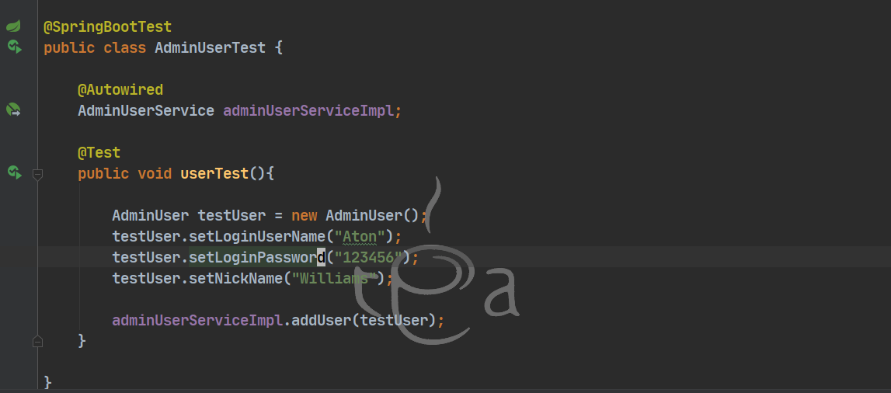

哦吼 


找不到对应的bean

查找了几十分钟资料 发现了这么一篇[博客](D:\Typro笔记\Code\Java\SpringBoot项目\InvalidBoundStatement.md)

直接第一条就中招  虚空绑定  绑定了个不存在的接口


修改之后 成功写入数据库


#### Controller层

##### 登陆页面

###### 首先，咱们先让画面显示出来。

写一个前端页面，并在controller中控制跳转。

这里我直接copy 原项目的登陆界面。xixi


使用到了th标签 也就是Thymeleaf中的内容

因此需要导入springboot-Thymeleaf。

```xml
    <dependency>
       <groupId>org.springframework.boot</groupId>
       <artifactId>spring-boot-starter-thymeleaf</artifactId>
       <version>2.6.6</version>
    </dependency>
```


可以看到 Thymeleaf的默认前缀是 templates文件夹下 因此红色框中 把login.html放在Templates中

注意到页面使用了其他插件 jquery ajax....

同样还有静态资源

根据表单发送的请求 编写Controller。

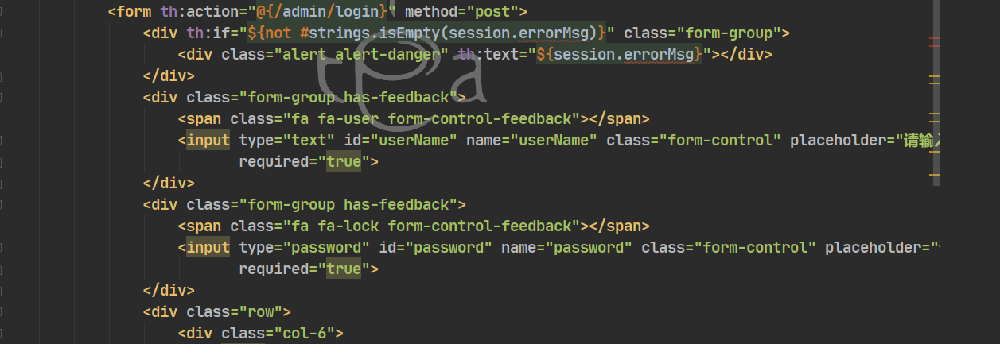

> 前端 id和name的区别：
>
> * id是唯一的，name不是唯一的
> * id一般用于页面单元的定位，name一般用于给后台传值.
>
> 


他们之间的映射关系如下图。


写完就能跑出登陆页面了 好耶

**注意：需要在启动类添加扫描Mapper**


###### 然后实现前端信息的接收


> 这里有个细节 在判断验证码是否正确的时候加上了判断session中是否有验证码的条件（我是没想到的）

1. [RequstParam](D:\Typro笔记\Code\Java\SpringBoot项目\AtonBlog\RequestParam.md)

> 1、加与不加的区别
>
> ```java
> @RequestMapping("/list1")
> public String test1(int userId) {
> 　　return "list";
> }
> @RequestMapping("/list2")
> public String test2(@RequestParam int userId) {
> 　　return "list";
> }
> ```
>
> （1）不加@RequestParam**前端的参数名**需要和后端控制器的**变量名**保持**一致**才能生效
>
> （2）**不**加@RequestParam参数为**非必传**，加@RequestParam写法参数为**必传**。但@RequestParam可以通过@RequestParam(required = false)设置为非必传。
>
> （3）@RequestParam可以通过@RequestParam(“userId”)或者@RequestParam(value = “userId”)指定传入的参数名。
>
> （4）@RequestParam可以通过@RequestParam(defaultValue = “0”)指定参数默认值
>
> （5）如果接口除了前端调用还有后端RPC调用，则不能省略@RequestParam，否则RPC会找不到参数报错
>
> （6）访问时：
>
> 不加@RequestParam注解：url可带参数也可不带参数，输入 localhost:8080/list1 以及 localhost:8080/list1?userId=xxx 方法都能执行
> **加@RequestParam注解：url必须带有参数**。也就是说你直接输入localhost:8080/list2 会报错，不会执行方法。只能输入localhost:8080/list2?userId=xxx 才能执行相应的方法
>
> 
>
> 

2. session

> 

这里往session中填写errorMsg 携带给前端读取显示。

同样使用Session拿到填写的验证码。


###### 验证码实现


[kapcha使用](https://blog.csdn.net/qq_45243783/article/details/111700493)

* 添加依赖

```xml
<!-- https://mvnrepository.com/artifact/com.github.penggle/kaptcha -->
<dependency>
    <groupId>com.github.penggle</groupId>
    <artifactId>kaptcha</artifactId>
    <version>2.3.2</version>
</dependency>
```

* 新建Kaptcha配置类 用于配置kapcha

```java
 @Bean
     public Producer kaptchaProducer(){
         Properties properties = new Properties();
          properties.setProperty("kaptcha.image.width","100");
          properties.setProperty("kaptcha.image.height","40");
               // 设置字体大小
          properties.setProperty("kaptcha.textproducer.font.size","32");
                  // 设置字体颜色
             properties.setProperty("kaptcha.textproducer.font.color","black");
           properties.setProperty("kaptcha.textproducer.char.string","0123456789ABCDEFGHIJKLMNOPQRSTUVWXYZ");
               // 截取4个字符
           properties.setProperty("kaptcha.textproducer.char.length","4");
              // 设置图像干扰，防止机器人暴力破解
           properties.setProperty("kaptcha.noise.impl","com.google.code.kaptcha.impl.NoNoise");

         DefaultKaptcha kaptcha = new DefaultKaptcha();
         Config config = new Config(properties);
           kaptcha.setConfig(config);
           return kaptcha;
     }
```

> 这里的稍微看了下源码：

> Configuration 和 Component
>
> 
>
> Configuration注解中有Component注解， 所以Configuration本质上还是Conponent

* 编写控制类获取验证码

这里原项目的代码似乎优点臃肿？

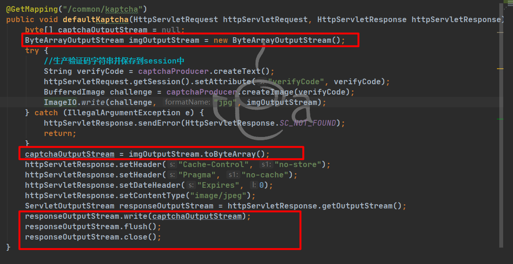

> ImageIO.write可以把图片写入到输出流中  后续的各种转化似乎就没有必要了？
>
> 基础不好：检查ImageIO.write的过程中 发现去除后面的outputStream.flush仍然可以正常输出图片
>
> 原因：
>
> 使用flush是为了更好的保障物力资源被回收。

```java
  @RequestMapping("/common/kaptcha")
    public void kaptchaProduce(HttpServletRequest req, HttpServletResponse resp){ 
	/**
     * 设置一些响应头
     */
    // Set to expire far in the past.
    resp.setDateHeader("Expires", 0);
    // Set standard HTTP/1.1 no-cache headers.
    resp.setHeader("Cache-Control", "no-store, no-cache, must-revalidate");
    // Set IE extended HTTP/1.1 no-cache headers (use addHeader).
    resp.addHeader("Cache-Control", "post-check=0, pre-check=0");
    // Set standard HTTP/1.0 no-cache header.
    resp.setHeader("Pragma", "no-cache");
    // return a jpeg
    resp.setContentType("image/jpeg");

    /**
     * 输出并存放信息 
     */
    //把当前时间存放到session中 用于检验是否超时
    req.getSession().setAttribute("verifyCodeGenTime",new Date());
    
    //生成文本
    String capText = kaptchaProducer.createText();
    //把文本存入session
    req.getSession().setAttribute("verifyCode",capText);
    
    //生成图片
    BufferedImage image = kaptchaProducer.createImage(capText);
    //使用输出流输出图片
    try {
        ServletOutputStream outputStream = resp.getOutputStream();
        ImageIO.write(image,"jpg",outputStream);
        outputStream.flush();
        outputStream.close();
    } catch (IOException e) {
        e.printStackTrace();
        System.out.println("验证码输出出错");
        return;
    }
    
}
```
然后 很好又有新问题了....

账号密码验证码都是对的 却**登录失败**。

###### 配置log4j2调试

springboot默认使用logback作为日志记录框架因此需要先排除


添加log4j2依赖

```xml
		<dependency>
			<groupId>org.springframework.boot</groupId>
			<artifactId>spring-boot-starter-log4j2</artifactId>
		</dependency>
```

在application.properties的同级建立logj2.xml  并在监控自定义下修改成自己要监控的包

```xml
<?xml version="1.0" encoding="UTF-8"?>
<!--      Configuration后面的status，这个用于设置log4j2自身内部的信息输出，可以不设置，
            当设置成trace时，可以看到log4j2内部各种详细输出
-->
<!-- monitorInterval：Log4j能够自动检测修改配置 文件和重新配置本身，设置间隔秒数 -->
<configuration monitorInterval="5">
	<!-- 日志级别以及优先级排序: OFF > FATAL > ERROR > WARN > INFO > DEBUG > TRACE > ALL -->
	
	<!-- 变量配置 -->
	<Properties>
		<!--
			格式化输出：
			%d表示日期，
			%thread表示线程名，
			%-5level：级别从左显示5个字符宽度
			%msg：日志消息，%n是换行符
			%logger{36} 表示 Logger 名字最长36个字符
		-->
		<property name="LOG_PATTERN" value="%d{yyyy-MM-dd HH:mm:ss.SSS} %highlight{%-5level}[%thread] %style{%logger{36}}{cyan} : %msg%n" />
		
		<!-- 定义日志存储的路径 -->
		<property name="FILE_PATH" value="日志文件存储路径" />
		<property name="FILE_NAME" value="项目名称" />
	</Properties>
	
	<appenders>
		<console name="Console" target="SYSTEM_OUT">
			<!--输出日志的格式-->
			<PatternLayout pattern="${LOG_PATTERN}" disableAnsi="false" noConsoleNoAnsi="false"/>
			<!--控制台只输出level及其以上级别的信息（onMatch），其他的直接拒绝（onMismatch）-->
			<ThresholdFilter level="debug" onMatch="ACCEPT" onMismatch="DENY"/>
		</console>
		
		<!--
		　　这个会打印出所有的info及以下级别的信息，每次大小超过size，
		　　则这size大小的日志会自动存入按年份-月份建立的文件夹下面并进行压缩，作为存档
		-->
		<RollingFile name="RollingFileInfo" fileName="${FILE_PATH}/info.log" filePattern="${FILE_PATH}/${FILE_NAME}-INFO-%d{yyyy-MM-dd}_%i.log.gz">
			<!--控制台只输出level及以上级别的信息（onMatch），其他的直接拒绝（onMismatch）-->
			<ThresholdFilter level="info" onMatch="ACCEPT" onMismatch="DENY"/>
			<PatternLayout pattern="${LOG_PATTERN}"/>
			<Policies>
				<!--interval属性用来指定多久滚动一次，默认是1 hour-->
				<TimeBasedTriggeringPolicy interval="1"/>
				<SizeBasedTriggeringPolicy size="20MB"/>
			</Policies>
			<!-- DefaultRolloverStrategy属性如不设置，则默认为最多同一文件夹下7个文件开始覆盖 -->
			<DefaultRolloverStrategy max="15"/>
		</RollingFile>
		
		<!-- 这个会打印出所有的warn及以下级别的信息，每次大小超过size，则这size大小的日志会自动存入按年份-月份建立的文件夹下面并进行压缩，作为存档-->
		<RollingFile name="RollingFileWarn" fileName="${FILE_PATH}/warn.log" filePattern="${FILE_PATH}/${FILE_NAME}-WARN-%d{yyyy-MM-dd}_%i.log.gz">
			<!--控制台只输出level及以上级别的信息（onMatch），其他的直接拒绝（onMismatch）-->
			<ThresholdFilter level="warn" onMatch="ACCEPT" onMismatch="DENY"/>
			<PatternLayout pattern="${LOG_PATTERN}"/>
			<Policies>
				<!--interval属性用来指定多久滚动一次，默认是1 hour-->
				<TimeBasedTriggeringPolicy interval="1"/>
				<SizeBasedTriggeringPolicy size="20MB"/>
			</Policies>
			<!-- DefaultRolloverStrategy属性如不设置，则默认为最多同一文件夹下7个文件开始覆盖-->
			<DefaultRolloverStrategy max="15"/>
		</RollingFile>
		
		<!-- 这个会打印出所有的error及以下级别的信息，每次大小超过size，则这size大小的日志会自动存入按年份-月份建立的文件夹下面并进行压缩，作为存档-->
		<RollingFile name="RollingFileError" fileName="${FILE_PATH}/error.log" filePattern="${FILE_PATH}/${FILE_NAME}-ERROR-%d{yyyy-MM-dd}_%i.log.gz">
			<!--控制台只输出level及以上级别的信息（onMatch），其他的直接拒绝（onMismatch）-->
			<ThresholdFilter level="error" onMatch="ACCEPT" onMismatch="DENY"/>
			<PatternLayout pattern="${LOG_PATTERN}"/>
			<Policies>
				<!--interval属性用来指定多久滚动一次，默认是1 hour-->
				<TimeBasedTriggeringPolicy interval="1"/>
				<SizeBasedTriggeringPolicy size="20MB"/>
			</Policies>
			<!-- DefaultRolloverStrategy属性如不设置，则默认为最多同一文件夹下7个文件开始覆盖-->
			<DefaultRolloverStrategy max="15"/>
		</RollingFile>
	</appenders>
	
	<!--Logger节点用来单独指定日志的形式，比如要为指定包下的class指定不同的日志级别等。-->
	<!--然后定义loggers，只有定义了logger并引入的appender，appender才会生效-->
	<loggers>
		<!--过滤掉spring和mybatis的一些无用的DEBUG信息-->
		<logger name="org.mybatis" level="info" additivity="false">
			<AppenderRef ref="Console"/>
		</logger>
		<!--监控系统信息-->
		<!--若是additivity设为false，则 子Logger 只会在自己的appender里输出，而不会在 父Logger 的appender里输出。-->
		<Logger name="org.springframework" level="info" additivity="false">
			<AppenderRef ref="Console"/>
		</Logger>
		
		<!--监控自定义-->
		<Logger name="com.lyh.AtonBlog.dao" level="debug" additivity="false">
			<AppenderRef ref="Console"/>
			<!--将sql语句输出到名字为RollingFileInfo的文件中-->
			<AppenderRef ref="RollingFileInfo" />
		</Logger>
		
		<root level="info">
			<appender-ref ref="Console"/>
			<appender-ref ref="RollingFileInfo"/>
			<appender-ref ref="RollingFileWarn"/>
			<appender-ref ref="RollingFileError"/>
		</root>
	</loggers>
</configuration>
```

针对我登陆失败的问题


查到了一条记录 说明dao层没问题

检查发现


第一反应是Mybatis的映射不对

因此 编写相应的resultMap  

注意property和你写的实体类属性名一致


根据以上思路 继续完成 **修改登陆信息** **修改密码** **退出登陆**

#### 其他部分

##### 名称和密码的修改


根据sidebar.html找到相应的入口


修改密码和名称中：

> 方法被@ResponseBody修饰
>
> @ResponseBody的作用其实是将java对象转为json对象（不是json字符串）。
>
> 

```java
/**
 * 修改密码
 */
@PostMapping("/profile/password")   password打错了 敲成 passwrod 浪费我几分钟。
@ResponseBody
public String passwordUpdate(@RequestParam("originalPassword") String original,
                             @RequestParam("newPassword") String newPassword,
                             HttpServletRequest request){
    
    //拿到新旧密码 判空
    if (original.isEmpty() || newPassword.isEmpty()){
        return "密码不能为空";
    }
    Integer userId = (int)request.getSession().getAttribute("loginUserId");
    if(adminUserService.updatePassword(userId,original,newPassword)){
        //密码更新成功 删除session中信息
        request.getSession().invalidate();   
        return "success";       这里的success 是前端AJAX判断是否修改成功的依据 改成其他返回值容易导致错误。       
    }else {
        return "修改失败";
    }
}

/**
 * 修改用户名和昵称
 */
@RequestMapping("/profile/name")
@ResponseBody
public String nameUpdate(@RequestParam("loginUserName") String loginUserName,
                         @RequestParam("nickName")String nickName,
                         HttpServletRequest request){
    //拿到数据 判空
    if (loginUserName.isEmpty() || nickName.isEmpty()){
        return "用户名或昵称不能为空";
    }
    
    Integer userId = (int)request.getSession().getAttribute("loginUserId");
    if (adminUserService.updateName(userId,loginUserName,nickName)){
        request.getSession().setAttribute("loginUser",nickName);
        return "success";
    }else {
        return "修改失败";
    }
    
}
```
密码修改后需要跳回登陆界面 于是引出拦截器。

##### 拦截器

编写Interceptor 拦截器对未登录用户进行拦截。


> 实现 HandlerInterceptor
>
> 


实现拦截器的步骤


* 别忘记注册组件 Component 和 Configuration
* **注意**：拦截器路径使用/**  *只是目录下一层， 而** 是目录下所有子集
* 记得在WebMvcConfigurer中注册拦截器  并配置白名单 放行静态资源

```java

@Component
public class LoginInterceptor implements HandlerInterceptor {
    @Override
    public boolean preHandle(HttpServletRequest request, HttpServletResponse response, Object handler) throws Exception {
    
        String servletPath = request.getServletPath();
        if (request.getSession().getAttribute("loginUser") == null && servletPath.startsWith("/admin")){
            request.getSession().setAttribute("errorMsg","登陆超时，请重新登陆");
            response.sendRedirect(request.getContextPath()+"/admin/login");
            return false;
        }else {
            return true;
        }
    }
    
    @Override
    public void postHandle(HttpServletRequest request, HttpServletResponse response, Object handler, ModelAndView modelAndView) throws Exception {
        
    }
    
    @Override
    public void afterCompletion(HttpServletRequest request, HttpServletResponse response, Object handler, Exception ex) throws Exception {
        
    }
}
```


```java
@Configuration
public class AtonBlogWebMvcConfig implements WebMvcConfigurer {
    
    @Autowired
    LoginInterceptor loginInterceptor;
    
    @Override
    public void addInterceptors(InterceptorRegistry registry) {
        registry.addInterceptor(loginInterceptor).addPathPatterns("/admin/**")
                .excludePathPatterns("/admin/login")
                .excludePathPatterns("/admin/dist/**")
                .excludePathPatterns("/admin/plugins/**");
        
        
    }
    
    @Override
    public void addResourceHandlers(ResourceHandlerRegistry registry) {
        registry.addResourceHandler("/upload/**").
                addResourceLocations("file:"+System.getProperty("user.dir") + "/");
        
    }
}
```

#### 进入主页

##### Index主页

在登陆成功后 这里重定向到index页面 可是为什么打开就404呢？


> return+文件的名字，就是纯粹用于跳转页面，将该资源响应给前端， 
>
> 而return+"redirect:"就用于再次向服务器发起请求。
>
> 因此需要先写一个针对/admin/index请求的方法 （因为这个类有一个**@RequstMapping("/admin")**）


添加之后由于首页有header footer等静态资源 所以我这里直接把所有的静态资源都导入了


> 注意用maven clean一下 target中可能没更新静态资源。


至此登陆功能暂时告一段落。

***

### 管理功能模块


#### 数据库建立

> 自己写起来才发现 这一部分的构思是很复杂的
>
> 往后可以考虑往这方面发展 数据库架构设计

我使用原作者的sql脚本 摸鱼了~~


#### 分类管理

> 请务必先编写这个部分，我开始是先编写博客管理部分，结果写到一般 发现内容涉及分类与tag的内容实在太多了，才调整文章顺序，先编写这一部分的。


##### Dao层

<a name="category">锚点</a>

思考需要哪些接口


* 对于分类的增删改查

好像就这了哦~~~


那就直接用<a href="#reverse">MybatisX生成一个模版</a>


##### Service层

###### 接口

这里我是复制mapper的接口到service中 进行修改

* 把 int 转化为对应的Boolean值（把与数据库打交道的”被影响的行数“ 转化成操作是否成功）
* 把前端的数据加以封装 categoryName categoryIcon 封装成BlogCategory对象与mapper交互。

```JAVA
public interface CategoryService {
    //后台管理页面服务
    
    /**
     * 对于类别的增删改查
     */

    Boolean deleteCategories(Integer[] ids);
    
    Boolean addCategory(String categoryName,String categoryIcon);
    
    BlogCategory findCertainCategory(Long id);
    
    Boolean updateCategory(Integer categoryId,String categoryName,String categoryIcon);
    
    
}
```


###### 实现类

删除分类


发现需要一个批量删除与修改原分组中的所有blog分类  所以在对应mapper中添加接口

删除用的是伪删除 只是把is_deleted字段更新了一下


新增接口updateBlogCategories并编写sql


***

添加分类


新加的接口 根据分类名判断是否已经存在该分类


注意：因为做的是伪删除 所以都要加上 is_deleted=0的条件。

***

更新分组


因为更新涉及到把存在的blog分类进行修改的操作，而到此还没有写Blog管理（我是先写的博客管理 写到一半感觉不对劲才来写分类管理的）

暂时可以先注释掉  已有blog更改分组这一条


***

###### 事务处理

在增删改上加上 @Transactional注解


> ## Java事务的类型
>
> java事务的类型有三种:JDBC事务、JTA(java Transaction API)事务、容器事务。
> 1、JDBC事务控制的局限性在**一个数据库连接内**，但是其使用简单。
>
> 2、JTA事务的功能强大，事务可以**跨越多个数据库或多个DAO**，使用也比较复杂。(Java Transaction API )
> 3、容器事务，主要指的是J2EE应用服务器提供的事务管理，**局限于EJB应用使用**。(Enterprise java bean)

Spring的事务机制明显属于第三种且具有以下两种事务管理方式


[事务相关](https://www.jianshu.com/p/f0662c10ce4f)

编程式事务：

> 
>
> 1. 说明：Spring为了简化事务管理的代码:提供了模板类 TransactionTemplate，所以手动编程的方式来管理事务，只需要使用该模板类即可！！
> 2. 手动编程方式的具体步骤如下：
>
> ```java
>   1. 步骤一:配置一个事务管理器，Spring使用PlatformTransactionManager接口来管理事务，所以咱们需要使用到他的实现类！！
>      <!-- 配置事务管理器 -->
>         <bean id="transactionManager" class="org.springframework.jdbc.datasource.DataSourceTransactionManager">
>             <property name="dataSource" ref="dataSource"/>
>       </bean>
> 
>     2. 步骤二:配置事务管理的模板
>         <!-- 配置事务管理的模板 -->
>         <bean id="transactionTemplate" class="org.springframework.transaction.support.TransactionTemplate">
> 		   <property name="transactionManager" ref="transactionManager"/>
>         </bean>
> 
>     3. 步骤三:在需要进行事务管理的类中,注入事务管理的模板
>         <bean id="accountService" class="com.itheima.demo1.AccountServiceImpl">
>             <property name="accountDao" ref="accountDao"/>
>             <property name="transactionTemplate" ref="transactionTemplate"/>
>         </bean>
> ```
>
> 3. 步骤四:在业务层使用模板管理事务:
>
> ```java
> // 注入事务模板对象
>         private TransactionTemplate transactionTemplate;
>         public void setTransactionTemplate(TransactionTemplate transactionTemplate) {
>             this.transactionTemplate = transactionTemplate;
>         }
> 
>         public void pay(final String out, final String in, final double money) {
>             transactionTemplate.execute(new TransactionCallbackWithoutResult() {
>                 protected void doInTransactionWithoutResult(TransactionStatus status) {
> 			  // 扣钱
>                     accountDao.outMoney(out, money);
>                     int a = 10/0;
>                     // 加钱
>                     accountDao.inMoney(in, money);
>                 }
>             });
>         }
> ```

声明式事务：

[Spring实现方式](D:\Typro笔记\Code\Java\SSM\Spring\声明式事务.md)

springboot中实现事务很简单


***

查询分类

* 还记得首页有一个分类数量吗 so public int getCategoriesCount();

* 以及最重要的展示分类List的功能

于是我稍加修改写出这两个玩意

> 主要是想添加一个搜索分类的功能 并且发现不需要多写一个接口 可以兼容


这里的PageUtil就在下面

###### 分页处理

构建分页参数模型


> Math.ceil() 浮点数向上取整
>
> 

分页工具类

> sql语句中需要使用到 limit  
>
> 因此通过工具类要获得记录的开始条数 以及一次显示条数
>
> 
>
> 该项目中的工具类 继承了LinkedHashMap 构造方法时传入一个map 把map中的值通过计算后放回map中
>
> 然后把这个map直接用于mapper的查询，即parameterType=map。

```JAVA
/**
 * 分页工具类
 */
@Data
public class PageUtil extends LinkedHashMap<String,Object> {
    
    //当前页码
    private int currentPage;
    //页面大小
    private int pageVolumn;
    
    public PageUtil(Map<String,Object> map){
        //注意开始页码和当前页面以及页面大小的关系。 limit 0,5 下标也是从0开始的。
        this.currentPage = Integer.parseInt(map.get("currentPage").toString());
        this.pageVolumn = Integer.parseInt(map.get("pageVolumn").toString());
        this.put("start",(currentPage-1)*pageVolumn);
        this.put("currentPage",currentPage);
        this.put("pageVolum",pageVolumn);
        
    }
    
}
```


##### Controller层

###### list显示

首先在sidebar的前端页面找到对应的入口。

保证点击sidebar时能够跳转到对应的页面。


红框内容用来供侧边栏高亮选中的模块页面。

> 突然想到 request.setAttribute 和 session.setAttribute有什么区别呢？
>
> 
>
> 所以 在登陆控制中 我们使用session存放登陆的用户名和id 而在这种只在当前请求页面需要用到的数据呢 可以保存在request中。

然后在对应js文件中找到用于请求分类列表的url


写到这里 有点疑问 

Q1:这里的Map参数是如何传过来的？

Q2:为什么是Get而不是Map？


A1：

使用[jqGrid组件](http://www.javashuo.com/article/p-mrbbcvvu-gy.html)

需要使用map接收。


A2：


~~之前还以为是有无参数来判断~~


补充返回结果对象


编写Result和ResultGenerator

Result：把数据和错误代码及信息封装到一个对象中

ResultGenerator：自然就是生成Result的类了。

Result中有这样一个属性。


[作用](https://blog.csdn.net/qq_45503106/article/details/107950914)

> 简单来说就是 主要用于版本控制  java序列化机制会自动生成一个serialVersionUID用于反序列化时的身份认证，指定则可让版本向上兼容。


ResultGenerator无非是一些信息和代码封装


[有关错误代码](https://blog.csdn.net/weixin_38778769/article/details/125380647)

常见


测试数据


运行测试后发现数据为空  可是我添加了一条数据啊！！！


debug发现 能够查找到该分组信息。

猜测可能是字段名字问题

果然 没有完全按照原项目的部分就出错了，挺好的出错才会进步嘛

我的叫data 


修改前前端读取的是list


###### 添加模态框


似乎没什么要动的 就把传进来的name和icon接收一下 判空返回相应的信息即可。


###### 分类修改

和上面的添加是一样的 只是多了个id 以及掉用不同方法。


###### 分类删除


这里看到使用了@RequestBody 为什么不用@RequestParam呢？


在对应的js文件中


##### 测试功能


添加报错：No Setter for id 什么的  mybatis。。。。。

生成的模版默认使用id字段当主键  而我的叫做categoryid...


更新报错：


这个问题磨了我几个小时  没有找对错误的地方

我更改多这个字段的类型  而模版又是生成了 于是便有了下图 麻了~~~

所以没事不要改字段。


到此，分类功能完成了

我想尝试添加一个分类搜索功能 于是：

###### 分类搜索

1. copy搜索样式


2. copy js函数 并修改函数名 请求地址


3. 为pageUtil工具类添加keyword的封装


4. 成功！！！


***

#### 标签管理


大致看来分为：List<BlogTag> getTagList(PageUtil pageUtil) 查询tag信息

添加tag 删除tag  模版生成（有个批量删除要自己写）

自行添加一个搜索功能。可以与查询list方法共用

以及分页相关：记录条数

作者还写了一个批量插入 但是好像没用到 我在这里实现一下。

##### Dao层

###### 查询TagList


使用MybatisX生成模版后 添加自定义的查询


###### 批量删除


###### 获得总记录数


##### Service层

###### 接口

把Dao层copy过来 大致服务分类 返回参数包装一下


注意要换个思路来考虑，因为前端传递过来的不会是一个BlogTag对象 而是他的名字


###### 实现类


这里需要在dao层添加一个根据Name查找的接口

不得不说 大佬的代码还是清晰啊。


查找list（关键词）


写这个思路得清晰。

pageUtil中携带的是当前页码 条目容量 这些是前端传过来的 是用户的要求

而PageProperties中的当前页码、条目容量、记录条数 是用来计算总页数 并且携带List传递给前端的。


批量删除tag

> 这里原项目是阻止删除存在关联关系（有博客用了这个标签）的tag。
>
> 我觉得不太合理，删除tag应当将拥有改tag的博客一并解除tag。
>
> 就像假如tag存在敏感词 我们该做的应该是删除所有 有该tag的博客的对应tag。


relationMapper还没写。。。


##### Controller层

###### 整体

找到 tag.js 根据里面的路径编写Controller层对应请求

别忘了从sidebar中找到控制tag页面显示的请求


###### 标签搜索

和前面分类搜索相同

1. copy html搜索框
2. copy js搜索函数

别忘了修改前端读取参数名

由你封装的Result 中的属性名决定。


##### 测试功能

由于原删除业务 存在不允许由关联的tag被删除

所以这里我先注释掉 防止编译报错 具体实现等后面


这里有个坑 就是模版生成的插入语句主键不会自动改成字段名

不过是小问题 等会看看能不能修改模版来解决。

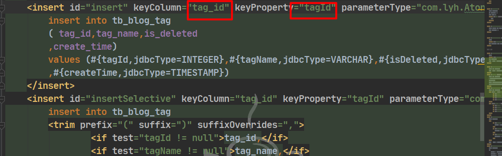


更改后再次测试


新增和删除都可行 但搜索不可用


修改后成功了！！


最后来尝试修改一下模版 找到更好的。


这里网上的资料甚少 不知道是不是有更好的替代品

就只添加了一个批量删除模版


***

#### 评论管理

~~这个评论管理内容比较匮乏~~

##### Dao层


批量审核：对comment_status的修改

回复：插入commentbody字段

批量删除


接口目前是这些  最后一个 我想添加一个撤销审核 所以状态有service控制。


##### Service层

###### 接口

目前只写了后台要用的服务


###### 实现类

```java
public class CommentServiceImpl implements CommentService {
    
    @Autowired
    BlogCommentMapper blogCommentMapper;
    
    @Override
    public Boolean deleteBatch(Integer[] ids) {
        //判断id是否为空
        if (ids.length > 0){
            return blogCommentMapper.deleteBatch(ids) >0;
        }
        return false;
    }
    
    @Override
    public Boolean replyComment(Long commentId, String reply) {
        //是否存在改评论 回复是否为空
        BlogComment blogComment = blogCommentMapper.selectByPrimaryKey(commentId);
        //这里注意判断评论状态
        if (blogComment != null && !reply.isEmpty() && blogComment.getCommentStatus() ==1){
            blogComment.setCommentBody(reply);
            blogComment.setReplyCreateTime(new Date());
            return blogCommentMapper.updateByPrimaryKey(blogComment) >0;
        }
        return false;
    }
    
    @Override
    public PageProperties getCommentListByKeyword(PageUtil pageUtil) {
    
        int totalCount = blogCommentMapper.countComment();
        List<BlogComment> commentList = blogCommentMapper.selectAllByMap(pageUtil);
        return new PageProperties(totalCount,
                pageUtil.getPageVolumn(),
                pageUtil.getCurrentPage(),
                commentList);
    }
    
    @Override
    public Boolean checkComment(Byte commentStatus, Long[] commentIds) {
        return blogCommentMapper.updateCommentStatusByCommentId(commentStatus,commentIds) >0;
    }
    
    @Override
    public int countComment() {
        return blogCommentMapper.countComment();
    }
}
```


##### Controller层

```java
@Controller
@RequestMapping("/admin")
public class CommentController {
    
    @Autowired
    CommentService commentService;
    
    /**
     * 跳转评论页面
     */
    @GetMapping("/comments")
    public String commets(HttpServletRequest request){
        request.setAttribute("path","comments");
        return "admin/comment";
    }
    
    /**
     * 批量审核
     */
    @PostMapping("/comments/checkDone")
    @ResponseBody
    public Result check(@RequestBody Long[] ids){
        //判空
        if (ids.length<0){
            return ResultGenerator.genFailResult("参数异常");
        }
        if (commentService.checkComment(1,ids)){
            return ResultGenerator.genSuccessResult();
        }else {
            return ResultGenerator.genFailResult("审核失败");
        }
    }
    
    /**
     * 撤审 或未过审
     */
    @PostMapping("/comments/unCheck")
    @ResponseBody
    public Result unCheck(@RequestBody Long[] ids){
        //判空
        if (ids.length< 0){
            return ResultGenerator.genFailResult("参数异常");
        }
        if (commentService.checkComment(-1,ids)){
            return ResultGenerator.genSuccessResult();
        }else {
            return ResultGenerator.genFailResult("撤销审核失败");
        }
    }
    
    /**
     * 回复
     */
    @PostMapping("/comments/reply")
    @ResponseBody
    public Result reply(@RequestParam("commentId")Long commentId,
                        @RequestParam("replyBody")String replyBody){
        //判空 id不能为空 或负数
        if (commentId == null || commentId < 1 || replyBody.isEmpty()){
            return ResultGenerator.genFailResult("参数异常");
        }
        if (commentService.replyComment(commentId, replyBody)){
            return ResultGenerator.genSuccessResult();
        }else {
            return ResultGenerator.genFailResult("回复失败");
        }
    }
    
    /**
     * 显示评论 可关键词
     */
    @GetMapping("/comments/list")
    @ResponseBody
    public Result list(@RequestParam Map<String,Object> map){
    
        //如果不存在页码信息 就报错
        if (StringUtils.isEmpty(map.get("currentPage")) || StringUtils.isEmpty(map.get("pageVolume"))){
            return ResultGenerator.genFailResult("参数异常");       
        }
        PageUtil pageUtil = new PageUtil(map);
        PageProperties commentList = commentService.getCommentListByKeyword(pageUtil);
        return ResultGenerator.genSuccessResult(commentList);
    
    }
    
    /**
     * 删除
     */
    @PostMapping("/comments/delete")
    @ResponseBody
    public Result delete(@RequestBody Integer[] ids){
        //判空
        if (ids.length < 1){
            return ResultGenerator.genFailResult("参数异常");
        }
        if (commentService.deleteBatch(ids)){
            return ResultGenerator.genSuccessResult();
        }else {
            return ResultGenerator.genFailResult("删除失败");
        }
    }    
}
```


留坑

添加一个不过审的按钮 使commentstatue为-1 但是它是tinyin型

 tinyint不能为负数？

测试发现：可行


前端没指定 Content-Type：application/json 而使用@RequestBody

结果就是这样的


写着写着 发现作者没有把页码数据完全封装进前端？


 测试接口看一下返还json的样子


还是封装进去了的  只是前端没用到 因为名字不同。


对前端代码稍加copy和修改

最后是这样的


***

#### BlogTag关系管理


暂时想不到要些什么sql 那就先用最基本的模版吧


这个service层也不需要 因为并没有直接的Controller对其进行管理


所以后续需要再进行添加。


***

#### 友链管理

页面长这样 老样子 加上根据关键词搜索


##### Dao层

本质上是一样的。


##### Service层


> 这里写到一半发现和前文写Category时不一样 
>
> 所以去把Link和Tag还有Comment的service mapper都稍微改一下 加上这个根据关键词统计数量

###### 实现类

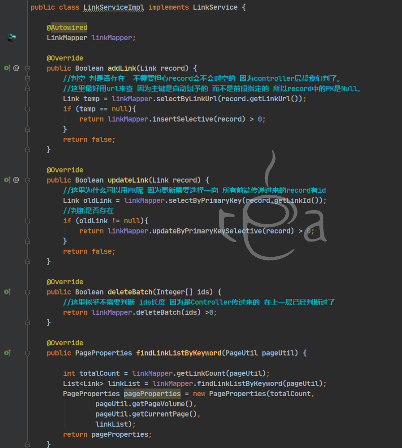

> 服务层的判空 是更加细致的判空 需要调用dao层的 比如上列的 判断是不是已经存在的Link
>
> 而Controller层的更多是对传过来的参数是不是为空的判断  然后再交给service层 所有service接到的参数不需要再次判空了。

写下来 感觉吗没什么复杂的业务逻辑 可能是后台的原因吗  希望前台会好点。


##### Controller层

大致和前面的一样

在写编辑link时 需要读取link的详细信息 所以需要加一个服务

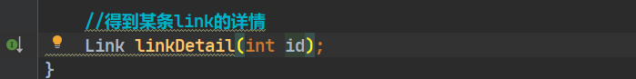


写添加连接时


注意前段的几个参数 别写成id了


更新连接的前端ajax中有判断data的


> 这里作者的做法时先判断空   然后在判断有没有id对应的连接
>
> 我决定这一步都已经在service中做了 所有没有必要 而且controller中只要做参数的简单校验 涉及逻辑的交给业务层。

而删除的只有resultCode条件


最后是老规矩 搜索copy过来

##### 测试功能

###### 添加功能


诶 我就好奇了 你什么玩意？

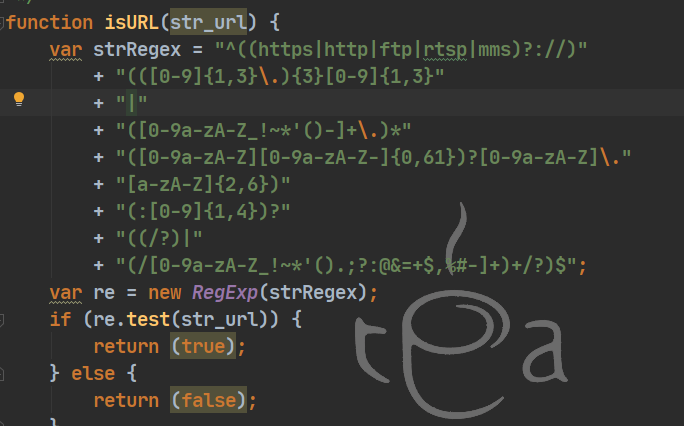

太不亲民了 还要加http

https://any86.github.io/any-rule/

换一个正则表达式。


错误


这里写出PostMapping 了导致获取不到list


###### 修改功能

点击修改模态框中**没有**信息

原因  原项目是把id拼贴到了url中 


而我的controller长这样 


在查看jquery文档后修改为 ~~原谅我的无知~~


###### 搜索功能

搜索条件不只限于名称

需要修改sql语句


不是很美观 能用就行~~


评论好像也能添加上这个功能。


***

#### 博客管理

>  轻车熟路后让我们来完成博客管理把！！！
>
> 注意部分内容是作为第一个模块写的。~~时间线混乱~~

##### 数据库建立


五个表 其中有部分是冗余的

* blog表不需要保存分类名称
* blog表不需要保存tag（blog和tag两表是多对多的关系 所以需要一个relation表来记录两者id）

##### 逆向工程

<a name="reverse">跳转到这里了！</a>


> Mybatis-Generator
>
> > MyBatis Generator（MBG）是MyBatis MyBatis 和iBATIS的[代码生成](https://so.csdn.net/so/search?q=代码生成&spm=1001.2101.3001.7020)器。它为所有版本的MyBatis以及版本2.2.0之后的iBATIS版本生成代码。它将根据数据库表生成可用于访问表的文件。
> >
> > Mybatis-generator主要完成的工作是依据数据库表创建对应的[model](https://so.csdn.net/so/search?q=model&spm=1001.2101.3001.7020)、dao、mapping文件，可以通过Maven插件或者mybatis-generator的jar包生成。
>
> 通用Mapper
>
> 
>
> > 正如之前提到的，当数据库字段变化频繁时，使用MBG（mybatis-generator）会带来大量的重构工作，对此，通用Mapper给出的解决办法是：给予开发者一个具备丰富的单表方法并且容易扩展的通用的Mapper。
>
> Mybatis-plus
>
> > Mybatis-Plus（以下简称MP）是Mybatis的增强工具（MBG和通用Mapper可看成插件），在Mybatis的基础上增加了很多功能，简化开发，提高效率。

[mybatis-plus笔记](D:\Typro笔记\Code\Java\SSM\Mybatis\Mybatis-Plus.md)


这里我使用MybatisX插件


稍加配置


自动生成mapper与mapper.xml文件

~~码农失业神器啊，看到了码农的未来了属于是。~~ 


<a href="#category">Back</a>


在生成后开始编写Service层。

##### **Service层**

思考Blog管理都需要些什么功能？

###### 编写接口

> 通过前端页面 找到对应的方法 blog.html-->blog.js-->BlogController-->BlogService （通过源代码辅助编写）
>
> 实际构建项目却是反方向进行的。


* 增加博客
  * String saveBlog(Blog blog) 传入Blog包含内容 返回处理结果文字信息
* 修改博客
  * String updateBlog（Blog blog）根据传入BlogId进行相应更新 返回处理结果文字信息
* 删除博客（可批量）
  * Boolean deleteBatch（Integer[] ids）根据勾选的id删除对应的blog
* 搜索关键词（根据标题/分类）
  * PageProperties getBlogsPageByKeyword(String keyword, int whichPage);
* 首页数量
  * 这里博客管理只需要负责总文章数所以 int getTotalBlogs(); 其他的数量由其他模块负责。
* 
* 分页（pageUtil）
  * PageProperties getBlogsForIndexPage(int whichPage);


***

<a name="VO介绍">锚点</a>

获取博客详情时使用到了一个BlogDetailVO（增加页面对应的VO）、SimpleBlogListVO（）

###### 这里留下一个为什么这些VO类都实现了Serializable？

> 注意 我暂时没有将其序列化！！


<a href="#封装VO">back</a>

***


所以我们根据前端需要显示的数据构建出这样的几个实体类。


**这里原工程涉及到一些有关前台页面的接口，暂时不方便编写。**

突然感觉很混乱， 要不直接开始实现吧 说不定其他的就迎刃而解了。


###### 实现类编写

新增


js控制新增按钮按下后 请求如下


可是这由控制层决定  咱都没写到那 怎么办

抽象出一个Blog对象 先编写这里。

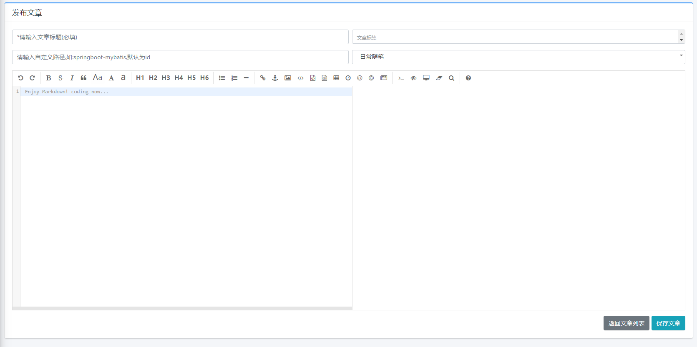


以上是之前写的内容，有点混乱 于是重新开始写。

首先 把数据库建好  

使用mabtisx模版生成基本sql语句  

添加一个关键词查找和批量删除以及统计数量的sql

原项目的sql是这样的


> 不太确定后面这几个and是否用得到  起码后台暂时是没啊用到的
>
> 所以我先不写了  之后再加就合理了。


原来还可以用括号啊  完全忘了~~~


Blog的service层极其复杂：

保存blog 需要处理category tag 和 blogTagRelation


首先我们来处理分类

* 先判断该分类是否存在 如果不存在就给他赋上默认的值
* 如果存在 你就放入相应的分类名 （我觉得这里似乎没有必要 数据库可以设计成只有categoryid的 而不需要name）


> 想要自己添加一个 如果该分类不存在那就添加的功能 但是前端部分不知道如何做  之后扩充内容再试试。

然后再处理标签

这里我不是很清楚前端传过来的tag是什么样的 之后打印出来看看。


再然后要做的就是保存文章到Blog中了。


这里遇到一个问题：


原因：保存博客的mapper语句是这样的


> ### [Mybatis](https://so.csdn.net/so/search?q=Mybatis&spm=1001.2101.3001.7020) 参数 useGeneratedKeys ，keyColumn，keyProperty作用和用法
>
> 
>
> 作用：
> 用于在mybatis插入完成一条数据后将对应的主键信息回填给实体
> 用法：
> useGeneratedKeys =“true”
> keyProperty=“id”,此属性对应的是pojo中的java实体中的属性。
> keyColumn=“id”,此属性为擦汗入后要回填的数据库的哪一列。
> 如上例子将数据库插入后的该条数据的id列回填到pojo的id属性。
> 实际使用场景如下：
>
> ```xml
>   <insert id="inertPojo" useGeneratedKeys="true" keyColumn="id" keyProperty="id">
>     <!-- 或者直接不显示的写key(主键) -->
>     insert into tb_pojo(key, param1, param2, ...)
>     values
>     (null, #{param1}, #{param2}, ...)
>   </insert>
> 123456
> ```
>
> 说明：
> 在mybatis的配置文件中，有个叫keyProperty和useGeneratedKeys的属性。useGeneratedKeys 参数只针对 insert 语句生效，默认为 false。当设置为 true 时，表示如果插入的表以自增列为主键，则允许 JDBC 支持自动生成主键，并可将自动生成的主键返回。


###### 保存文章业务的整体逻辑

以表为单位 对于blog表插入的前提条件有：

​	分类你总得有一个把 没有我就设成默认，有就rank+1方便后续更新

​	tag你不能太多

对于tag表：

​	 你要把不存在的tag更新进来

对于category表：

​	你要把rank更新一下 就是前面处理的结果

对于relation表：

​	你要把所有的tag 和当前这个blog的关系对应起来 有多少个tag就要新增多少条记录

> 以上 为了提高数据库效率 减少数据库操作 
>
> 我们把待更新的记录封装成list 一次更新。


###### 更新博客


更新部分差不太多  只是多了

把更新数据放入原blog中

删除原先有关该博客的所有tag

```java
 @Override
    @Transactional
    public String updateBlog(Blog blog) {
        //得到待更新的博客
        Blog blogForUpdate = blogMapper.selectByPrimaryKey(blog.getBlogId());
        if (blogForUpdate == null){
            return "数据不存在";
        }
        //把修改后的数据 填到要更新的对象中
        blogForUpdate.setBlogTitle(blog.getBlogTitle());
        blogForUpdate.setBlogSubUrl(blog.getBlogSubUrl());
        blogForUpdate.setBlogContent(blog.getBlogContent());
        blogForUpdate.setBlogCoverImage(blog.getBlogCoverImage());
        blogForUpdate.setBlogStatus(blog.getBlogStatus());
        blogForUpdate.setEnableComment(blog.getEnableComment());
    
        //对于需要更新的blog的分类进行处理 
        BlogCategory blogCategory = categoryMapper.selectByPrimaryKey(blog.getBlogCategoryId());
        if (blogCategory==null){
            //分类不存在就设置成默认
            blogForUpdate.setBlogCategoryId(0);
            blogForUpdate.setBlogCategoryName("默认分类");
        }else {
            //分类存在就设置成该分类 并rank+1
            blogForUpdate.setBlogCategoryName(blog.getBlogCategoryName());
            blogForUpdate.setBlogCategoryId(blog.getBlogCategoryId());
            //rank+1
            blogCategory.setCategoryRank(blogCategory.getCategoryRank());
        }
        //处理标签数据
        String[] tags = blog.getBlogTags().split(",");
        if (tags.length > 6){
            return "标签数量限制为6";
        }
        blogForUpdate.setBlogTags(blog.getBlogTags());
        //新增的tag对象
        List<BlogTag> tagListForInsert = new ArrayList<>();
        //所有tag对象
        List<BlogTag> allTagList = new ArrayList<>();
        //遍历tag 对tag进行区分
        for (int i = 0; i < tags.length; i++) {
            BlogTag tag = tagMapper.selectByTagName(tags[i]);
            if (tag == null){
                //新增 
                tag.setTagName(tags[i]);
                tagListForInsert.add(tag);
            }else {
                allTagList.add(tag);
            }
        }
        //把新tag正式写入数据库
        if ( !CollectionUtils.isEmpty(tagListForInsert)){
            tagMapper.BatchInsertTagList(tagListForInsert);
        }
        //分类表： 更新分类
        if (blogCategory != null){
            //这里主要是更新了 category表的rank
            categoryMapper.updateByPrimaryKeySelective(blogCategory);
        }
        
        //关系表： 删除原有关系 新增关系
        //新增关系数据
        List<BlogTagRelation> relationList = new ArrayList<>();
        allTagList.addAll(tagListForInsert);
        for (BlogTag tag : allTagList) {
            BlogTagRelation relation = new BlogTagRelation();
            relation.setTagId(tag.getTagId());
            relation.setBlogId(blog.getBlogId());
            relationList.add(relation);
        }
        
        relationMapper.deleteByPrimaryKey(blog.getBlogId());
        relationMapper.insertBatch(relationList);
        
        if (blogMapper.updateByPrimaryKeySelective(blogForUpdate) >0){
            return "success";
        }
        return "修改失败";
        
    }
```

其他的删除和搜索操作就没什么业务上的东西了


###### 删除博客

这里原项目疏忽了对于category表 以及relation表的处理 

所以我自己加一下。


本来向使用map存放id和rank需要减多少  结果因为批量更新写不出来就用来这种简单的方法

回过头来 看看[批量更新怎么写](https://blog.csdn.net/liukai6/article/details/89522033)


折磨了一个小时


> # mybatis3.4.6 批量更新 foreach 遍历map 的正确姿势详解
>
>  更新时间：2020年11月27日 10:57:13  作者：小团团开心鸭  
>
> 这篇文章主要介绍了mybatis3.4.6 批量更新 foreach 遍历map 的正确姿势详解，具有很好的参考价值，希望对大家有所帮助。一起跟随小编过来看看吧
>
> 好久没编码了！最近开始编码遇到一个问题 ！一个批量修改的问题，就是mybatis foreach 的使用。
>
> 当时使用的场景 ,前端 传逗号拼接的字符串id, 修改id对应数据的数据顺序 ，顺序 就是id 的顺序.
>
> 就是一个条件(单个id值) 修改一个值(传入的id的顺序) ,
>
> 1、 把条件作为Map 的key 修改值是value，用map入参
>
> 2、用List<Object> 或者数组 ，把条件和值封装成对象放进list集合或者array数组
>
> 3、代码使用for循环调用mapper方法 穿两个参数。
>
> 因为考虑到第二种用法，需要不断创建对象 放进数组在 遍历数组获取对象取值。从虚拟机的堆内存考虑，放弃------------------------
>
> 第三种方法，会循环多少次就执行多少条sql语句，放弃-----------------------
>
> 于是使用Map,
>
> 可是在mybatis中参数是map的foreach使用,对于很久没编码的我，实在是忘记得很干净。于是百度一堆，一致性 就是报错：
>
> 
>
> 
>
> 把打印出的sql语句放到navicat 执行 可以执行不会报错。那问题是什么（这里想来我1个小时），最后没办法 直接看mybatis的官网，把sql改成如下，正确执行。
>
> 下面给出正确的mybatis中foreach的map的姿势,避免大家以后在这上面浪费时间 ，直接上代码，涂改部分因公司保密协议问题（大家都知道是表名）：
>
> **mapper**
>
> 
>
> 一定要加@Param注解
>
> mapper.xml
>
> 


##### Controller层

edit页面

需要读取所有category 后端把他存到request中 供前端读取

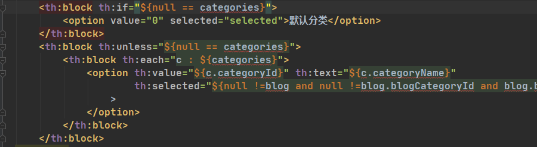


这里需要新写一个service 用于获得所有category 不需要封装成PageProperties


save按钮

​		先判空 然后封装


更新的话只需要把 blogService.saveBlog 改成updateBlog就行了。


但是在更新前 需要先根据id获得blog的信息 然后再修改。


这里是根据url传参的 所以：


##### 测试一下

**问题1 新增tag参数为空**


修改成这样就好了

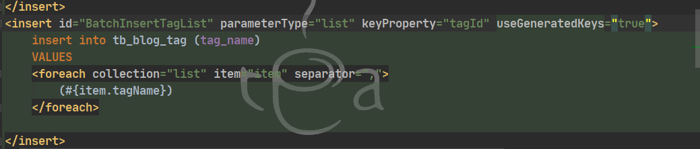

**问题2 更新失败**

​	

更新完全复制save 导致没有封装id属性 于是更新失败。


**问题3 无论tag是否存在都会新增**

在根据tagname获得tag对象的时候 返回类型写的是resultType 而不是resultMap  

resultType要求字段和属性一致才能对应上


#### 系统配置

把数据库导入 然后MybatisX


大致看来 service层需要查找所有config。

更新config


#### Service层

##### 接口


##### 实现类

这中间使用到了streamAPI和lambda表达式 所以我花了一段时间去学了以下java8新特性

```JAVA
@Service
public class ConfigImpl implements ConfigService {
    
    
    public static final String websiteName = "personal blog";
    public static final String websiteDescription = "personal blog是SpringBoot2+Thymeleaf+Mybatis建造的个人博客网站.SpringBoot实战博客源码.个人博客搭建";
    public static final String websiteLogo = "/admin/dist/img/logo2.png";
    public static final String websiteIcon = "/admin/dist/img/favicon.png";
    
    public static final String yourAvatar = "/admin/dist/img/13.png";
    public static final String yourEmail = "1198640816@qq.com";
    public static final String yourName = "Aton";
    
    public static final String footerAbout = "your personal blog. have fun.";
    public static final String footerICP = "Null";
    public static final String footerCopyRight = "Null";
    public static final String footerPoweredBy = "personal blog";
    public static final String footerPoweredByURL = "##";
    
    @Autowired
    ConfigMapper configMapper;
    
    @Override
    public Boolean updateConfig(String configName, String configValue) {
        Config config = configMapper.selectByPrimaryKey(configName);
        if (config != null){
            config.setConfigValue(configValue);
            config.setUpdateTime(new Date());
            return configMapper.updateByPrimaryKeySelective(config) > 0;
        }
        return false;
    }
    
    @Override
    public Map<String,String> getAllConfig() {
        List<Config> configs = configMapper.selectAllConfig();
        //把所有的config项封装成map
        Map<String, String> configMap = configs.stream()
                .collect(Collectors.toMap(Config::getConfigName, Config::getConfigValue));
        
        //对map中的项进行判空 与赋默认值
        for (Map.Entry<String, String> config : configMap.entrySet()) {
            
            if ("websiteName".equals(config.getKey()) && config.getValue().isEmpty()){
                config.setValue(websiteName);
            }
            if ("websiteDescription".equals(config.getKey()) && config.getValue().isEmpty()){
                config.setValue(websiteDescription);
            }
            if ("websiteLogo".equals(config.getKey()) && config.getValue().isEmpty()){
                config.setValue(websiteLogo);
            }
            if ("websiteIcon".equals(config.getKey()) && config.getValue().isEmpty()){
                config.setValue(websiteIcon);
            }
            if ("yourAvatar".equals(config.getKey()) && config.getValue().isEmpty()){
                config.setValue(yourAvatar);
            }
            if ("yourEmail".equals(config.getKey()) && config.getValue().isEmpty()){
                config.setValue(yourEmail);
            }
            if ("yourName".equals(config.getKey()) && config.getValue().isEmpty()){
                config.setValue(yourName);
            }
            if ("footerAbout".equals(config.getKey()) && StringUtils.isEmpty(config.getValue())) {
                config.setValue(footerAbout);
            }
            if ("footerICP".equals(config.getKey()) && StringUtils.isEmpty(config.getValue())) {
                config.setValue(footerICP);
            }
            if ("footerCopyRight".equals(config.getKey()) && StringUtils.isEmpty(config.getValue())) {
                config.setValue(footerCopyRight);
            }
            if ("footerPoweredBy".equals(config.getKey()) && StringUtils.isEmpty(config.getValue())) {
                config.setValue(footerPoweredBy);
            }
            if ("footerPoweredByURL".equals(config.getKey()) && StringUtils.isEmpty(config.getValue())) {
                config.setValue(footerPoweredByURL);
            }
        }
        return configMap;
    }
}
```

##### Controller层

这里我改成了封装成map 这样controller层就和之前category的controller功能上差不太多了。

（强迫症感到舒适~~）


于是serviceImpl变成了这样


相应的 批量更新的sql：


对应的xml


赶紧测试以下能不能批量更新

如果打不开配置页面 报空指针异常 看看是不是sql的resultMap弄错了。

***


#### 收尾完善

到此 功能大致完成了 查漏补缺一下


-1 是之前为了方便 随便改的

在AdminController中完善即可


好像还有一些遗漏的


这个上传图片我怎么没有印象  还有随机封面怎么实现的呢？

##### [上传](https://www.jianshu.com/p/9573d7193329?u_atoken=300a93b1-7668-451d-98c2-11ee0bb207d4&u_asession=01da6YrQArWMrc8bOpjMFp56BGpTyjpodadypvPODAikwZzRX7k_6P-QajbihD5OeUX0KNBwm7Lovlpxjd_P_q4JsKWYrT3W_NKPr8w6oU7K8-KWCGFRS8ZMvpKrdK6DVYPIF6hypDqzN_tz02ZDuS7GBkFo3NEHBv0PZUm6pbxQU&u_asig=05Du4XJ0fK6lLGPpLPouPbTw00MEWIQKlinpSrchdifVFhtNgzYZtJs7PLtO3uDsVycY0nOx1wu-5dyyLnYvprTEiT6M0csbexm8_Ws7bLw2UdnM1Ofa9pNmdQJOrBFVxVHQDPSoK6LhKiFn9LMBNYRQ2_ogIyen1DRZKjEp2F-hT9JS7q8ZD7Xtz2Ly-b0kmuyAKRFSVJkkdwVUnyHAIJzTOl8ctweERc7npInh519yqJzjcM7VQXdI1roTxLS5evHLC90DffcRgc58NhmjbgM-3h9VXwMyh6PgyDIVSG1W9HEbHWA-xctu-A-3OsSZd_LrOBOWgTd5WAMvZk50HQNCeYBBFZmGH5dn-MqO4pHqBLhXsOSUiGMFh-kST67ILtmWspDxyAEEo4kbsryBKb9Q&u_aref=kZSBKv0%2F%2FU%2BFuK0JLIVyI9krz3Q%3D)

###### 封面上传

封面上传和md中图片的上传路径是不一样的。


> #### 1.文件保存在服务器，url地址保存在数据库
>
> ```java
> 	/**
> 	 * 1.文件保存在服务器，url地址保存在数据库
>      * 上传成功之后返回成功保存的url地址
>      */
> @PostMapping("/upload")
>     public @ResponseBody String upload(@RequestParam MultipartFile file, HttpServletRequest request){
>         if(!file.isEmpty()){
>             String uploadPath = "C:\\uploadFile";
>             // 如果目录不存在则创建
>             File uploadDir = new File(uploadPath);
>             if (!uploadDir.exists()) {
>                 uploadDir.mkdir();
>             }
>             String OriginalFilename = file.getOriginalFilename();//获取原文件名
>             String suffixName = OriginalFilename.substring(OriginalFilename.lastIndexOf("."));//获取文件后缀名
>             //重新随机生成名字
>             String filename = UUID.randomUUID().toString() +suffixName;
>             File localFile = new File(uploadPath+"\\"+filename);
>             try {
>                 file.transferTo(localFile); //把上传的文件保存至本地
>                 /**
>                  * 这里应该把filename保存到数据库,供前端访问时使用
>                  */
>                 return filename;//上传成功，返回保存的文件地址
>             }catch (IOException e){
>                 e.printStackTrace();
>                 System.out.println("上传失败");
>                 return "";
>             }
>         }else{
>             System.out.println("文件为空");
>             return "";
>         }
>     }
> ```
>
> #### 2.直接把文件以[二进制](https://so.csdn.net/so/search?q=二进制&spm=1001.2101.3001.7020)形式保存到数据库中数据类型为blob的一个字段
>
> ```java
> /**
> *上传图片，使用mybatis-plus保存到数据库
> *User为实体类，数据库对应user表，有id、image两个属性
> */
> @PostMapping("/upload")
>     @ResponseBody
>     public String upload(@RequestParam("file") MultipartFile file) throws Exception{
>         if(!file.isEmpty()){
>             User user=new User();
>             user.setImage(file.getBytes());
>             userMapper.insert(user);
>         }
>         return "ok";
>     }
> /**
> *前端通过id获取数据库中的图片
> */
>     @GetMapping("/getImage")
>     @ResponseBody
>     public void getImage(String id,HttpServletResponse resp) throws Exception{
>         User user=userMapper.selectById(id);
>         byte[] image = (byte[])user.getImage();
>         resp.setContentType("image/jpeg");
>         ServletOutputStream out = resp.getOutputStream();
>         out.write(image);
>         out.flush();
>         out.close();
>     }
> ```
>
> #### 3.前端代码
>
> ```html
> <form action="/upload" method="post" enctype="multipart/form-data">
>     <input type="file" name="file" /><br/>
>     <input type="submit" name="" id="" value="提交" />
> </form>
> ```


copyMyBlogUtil工具类 和 uploadController


记得注册@Controller

上传测试


这里我修改了路径 于是需要新建两个目录 所以mkdir报错了

应该使用mkdirs 才能创建多级目录。

修改后新问题出现了


上传成功但是不能显示。

为什么不能显示呢？ 根据前端代码看到这里是用 r.data显示图片的


后端部分也只是把url+/upload/+fileName 传了过去 

实际的url就是  localhost:port/upload/fileName 可是这个在我电脑上就是404


于是乎我把原项目部署到了linux服务器上。

使用jar包直接运行  jar包在root/deploy/下面

而图片上传存放的位置是作者默认的 /opt/deploy/upload/ 这种情况下 网页却能正常显示上传的图片 并且也无404错误。


> 就是说 图片的请求路径是 localhost:8080/upload/xxxx.jpg  可是这个路径没有映射的内容啊 所以我的项目就直接404了

查看这个常量的使用处发现一个奇怪的东西。


资源处理


作者的这里把/upload/**下的所有url 都映射到常量对应的位置去。

而我的。。。。 映射到了这个项目中来。


修改之后 就可以正常显示了。

###### md编辑器图片上传

https://pandao.github.io/editor.md/

因为都是上传 所以我们先copy之前的 然后对返回的参数和接收的参数稍作修改


这些参数是editormd的[固定参数](https://blog.csdn.net/weixin_42619772/article/details/114627101)由富文本编辑器决定的。


> response.getWriter.write是干嘛的？
>
> 

为什么用response传递呢？

当然可以用json

由于editormd要求数据是这样的：


 而我们使用的result对象进行了封装 实际结果是： 层级关系不太一样

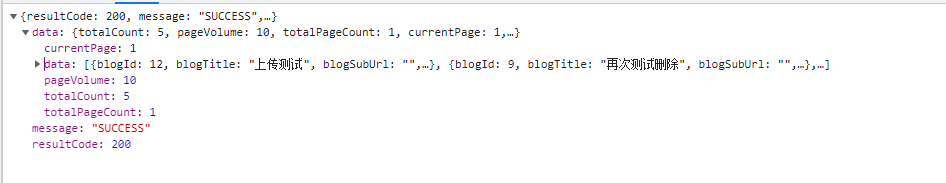

所以这里我们用fastjson的jsonobject来存放。

```xml
		<dependency>
			<groupId>com.alibaba</groupId>
			<artifactId>fastjson</artifactId>
			<version>1.2.28</version>
		</dependency>
```
 把信息封装到json中


别忘了加@ResponseBody


###### 部署Swagger


> 导包
>
> ```XML
> <!--swagger-->
>         <dependency>
>             <groupId>io.springfox</groupId>
>             <artifactId>springfox-swagger2</artifactId>
>             <version>2.9.2</version>
>         </dependency>
>         <dependency>
>             <groupId>io.springfox</groupId>
>             <artifactId>springfox-swagger-ui</artifactId>
>             <version>2.9.2</version>
>         </dependency>
> <!--Springfox整理api-->
> <!-- https://mvnrepository.com/artifact/io.springfox/springfox-boot-starter -->
> <dependency>
>     <groupId>io.springfox</groupId>
>     <artifactId>springfox-boot-starter</artifactId>
>     <version>3.0.0</version>
> </dependency>
> ```
>
> 建立配置文件 直接用默认项
>
> 

启动后报空指针异常或文件找不到

文件找不到：更换swagger 版本

[空指针](https://blog.csdn.net/weixin_49523761/article/details/122305980?spm=1001.2101.3001.6661.1&utm_medium=distribute.pc_relevant_t0.none-task-blog-2%7Edefault%7ECTRLIST%7ERate-1-122305980-blog-120581429.pc_relevant_multi_platform_whitelistv3&depth_1-utm_source=distribute.pc_relevant_t0.none-task-blog-2%7Edefault%7ECTRLIST%7ERate-1-122305980-blog-120581429.pc_relevant_multi_platform_whitelistv3&utm_relevant_index=1)：配置

```XML
spring.mvc.pathmatch.matching-strategy=ant-path-matcher
```

3.0版本的swagger默认地址http://localhost:8080/swagger-ui/index.html

[补齐注释](https://blog.csdn.net/weixin_46295656/article/details/114466463)

回头去补注释真难受

还是要随着项目一起建立


###### 多配置文件

主配置文件只要选择哪个配置文件即可


到此 后台部分就完成了

***


### 后台扩充内容

除了几个copy的搜素框，我还想要为后台添加一些功能

- [ ] category和tag 能够点进去 看到哪些blog有这个属性
- [ ] 评论能看到评论的博客 并点击跳转
- [ ] 评论可以弄成论坛的样式 登陆用户可以回复评论
- [x] 部署swagger 
- [x] list添加记录条数
- [ ] 我的页面代码能直接看到 而csdn的不能直接看到 为什么
- [ ] 添加动态搜索 就像百度时打关键词的时候就开始搜索
- [ ] 登陆 验证码输错了 不要全部重输入 (X)
- [ ] 评论看不到对应的博客.
- [ ] 添加博客页面不能添加分类 而是搜索（把搜索改成分类）
- [ ] i18n
- [x] 记住密码
- [ ] 在线人数 redis
- [ ] 流量控制 记录ip
  - [ ] 上面两项苦于前端不会 后续再补全
- [ ] nginx负载均衡
- [ ] 系统配置页面 上传logo、头像等

##### list添加记录条数

这个简单 因为页面使用的是jqgrid 所以只需要在对应的地方开启即可

后端的totalCount也都封装进Result了。


[jqgrid参数详解](https://blog.csdn.net/qq_27009517/article/details/117018332)


##### 登陆输错验证码整个页面都会刷新

输错后验证码会自动刷新的原因


> 这就是为什么要用new date的原因

这个功能我能力有限 实在没有思路

但是看到有点网站就是这样的 只是有了记住密码功能 所以能自动填入账号和密码

所以我就转向做记住密码功能了。


##### 记住密码

https://www.freesion.com/article/6301954524/

https://blog.csdn.net/IndexMan/article/details/118726437

原本使用session来记录用户登陆信息 只在一次对话中有效

就是说你把浏览器关闭了 再次进入就要登陆。

而放在cookie中 只有注销以及cookie过期才会需要登陆


所以session一般存放的用户信息是用于页面跳转之间，比如用户管理 有个 ‘你好 UserName’ 这种东西


> # 浏览器的cookie和服务器存储的session有什么关联，下面妙文为你解答
>
> 首先**session是存储在服务器端，cookie是存储在客户端的**，所以安全来讲session的安全性要比cookie高.
>
> 然后我们获取session里的信息是通过存放在会话cookie里的sessionid获取的。又由于session是存放在服务器的内存中，所以session里的东西不断增加会造成服务器的负担，**所以会把很重要的信息存储在session中，而把一些次要东西存储在客户端的cookie里**.
>
> 然后cookie确切的说分为两大类分为**会话cookie和持久化cookie**，会话cookie确切的说是存放在客户端浏览器的内存中，所以说他的生命周期和浏览器是一致的，浏览器关了会话cookie也就消失了，然而持久化cookie是存放在客户端硬盘中，而持久化cookie的生命周期就是我们在设置cookie时候设置的那个保存时间，然后我们考虑一问题当浏览器关闭时session会不会丢失.
>
> 从上面叙述分析**session的信息是通过sessionid获取的**，而**sessionid是存放在会话cookie当中的**，**当浏览器关闭的时候会话cookie消失所以我们的sessionid也就消失了，但是session的信息还存在服务器端**，这时我们只是查不到所谓的session但它并不是不存在。那么，session在什么情况下丢失，就是在服务器关闭的时候，或者是sessio过期，再或者调用了invalidate()的或者是我们想要session中的某一条数据消失调用session.removeAttribute()方法，然后session在什么时候被创建呢，确切的说是通过调用session.getsession来创建，这就是session与cookie的区别

**AdminController.login**

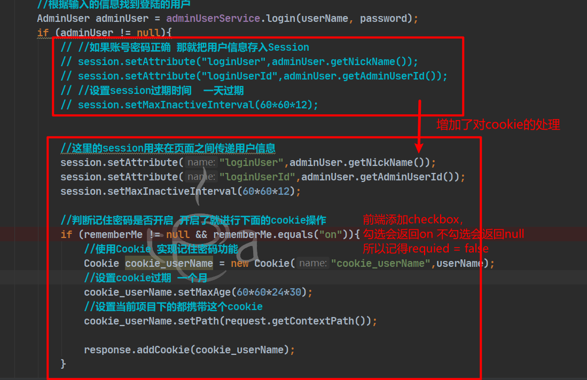

**AdminController.Logout**


> 这里把同名cookie赋空 然后设置过期时间为0 挺有意思的 为什么没有个删除的方法呢

**LoginInterceptor**

```JAVA
@Component
public class LoginInterceptor implements HandlerInterceptor {
    
    @Autowired
    AdminUserMapper adminUserMapper;
    
    @Override
    public boolean preHandle(HttpServletRequest request, HttpServletResponse response, Object handler) throws Exception {
        
        //从request中获取cookie 判空
        Cookie[] cookie = request.getCookies();
        HttpSession session = request.getSession();

        //因为有前台页面不需要登陆也可以访问 所以这里要获取访问的路径 判断是不是后台
        String servletPath = request.getServletPath();
        if (!servletPath.startsWith("/admin")){
            return true;
        }
        
        //判断有无cookie 并获取cookie内容即userName
        String userName = "";
        boolean haveCookie = false;
        if (cookie != null){
            for (Cookie temp : cookie) {
                if (temp.getName().equals("cookie_userName") && temp.getValue() !=null) {
                    userName = temp.getValue();
                    haveCookie = true;
                    break;    
                }
            }
        }
        
        //判断有没有session 1.不为空 2.要有loginUser 和loginId
        boolean haveSession =false;
        if (session != null && 
                session.getAttribute("loginUser") != null && 
                session.getAttribute("loginUserId") != null){
            haveSession = true;
        }
        
        //1.记住密码：有cookie 判断有没有session 有就直接进入 没有的话就补充session 然后进入
        //2.不记住密码：无cookie 判断有无session 有的话就进入 没有就退出
        //3.保证访问的页面是以/admin开头
        if (haveCookie){
            //存在cookie 检测session是否存在 没有就补充
            if (haveSession){
                return true;
            }else {
                //session过期 而cookie还有
                AdminUser adminUser = adminUserMapper.selectByLoginUserName(userName);
                session.setAttribute("loginUser",adminUser.getNickName());
                session.setAttribute("loginUserId",adminUser.getAdminUserId());
                session.setMaxInactiveInterval(60*60*12);
                return true;
            }
        }else {
            //没有cookie 判断有没有session
            if (haveSession){
                return true;
            }else {
                //测试重定向能否使用request中的内容 结果是不能
                // request.setAttribute("errorMsg","用户信息已过期，请重写登陆");
                request.getSession().setAttribute("errorMsg","登陆信息已过期，请重新登陆");
                response.sendRedirect("/admin/login");
                return false;
            }
        }
        return false;
       
    
        /**
         * 原项目 用session存储 无记住密码
         */
        // String servletPath = request.getServletPath();
        // if (request.getSession().getAttribute("loginUser") == null && servletPath.startsWith("/admin")){
        //     request.getSession().setAttribute("errorMsg","登陆超时，请重新登陆");
        //     response.sendRedirect("/admin/login");
        //     return false;
        // }else {
        //     return true;
        // }
    
        /**
         * 下方例子不使用我的项目，不知道为什么 idea会自动生成两个cookie 所以这个判空就太简易了
         */
        //
        // //这里存在两种情况 一种是记住了密码有cookie 还有一种是不勾选记住密码只有session
        // if (cookie == null && servletPath.startsWith("/admin") && session == null){
        //     //这里测试以下request中存值能不能在重定向后读取
        //     request.setAttribute("errorMsg","用户信息过期，请重新登陆");
        //     response.sendRedirect("/admin/login");
        //     return false;
        // }else if (cookie == null && servletPath.startsWith("/admin") && session != null){
        //     if (request.getSession().getAttribute("loginUser") == null && servletPath.startsWith("/admin")){
        //         request.getSession().setAttribute("errorMsg","登陆超时，请重新登陆");
        //         response.sendRedirect("/admin/login");
        //         return false;
        //     }else {
        //         return true;
        //     }
        // }
        //
        // //遍历cookie
        // Cookie[] cookies = request.getCookies();
        // //存放cookie中读取的内容
        // String userName = "";
        // for (Cookie item : cookies) {
        //     if (item.getName().equals("cookie_userName")){
        //         userName = item.getValue();
        //         break;
        //     }
        // }
        //
        // //检查cookie中的内容是不是空
        // if (userName.isEmpty()){
        //     response.sendRedirect("/admin/login");
        //     return false;
        // }
        //
        // //session如果过期了 而cookie还在（session在服务器端，cookie在本地）
        // Object loginUser = session.getAttribute("loginUser");
        // if (loginUser == null){
        //     AdminUser adminUser = adminUserMapper.selectByLoginUserName(userName);
        //     session.setAttribute("loginUser",adminUser.getNickName());
        //     session.setAttribute("loginUserId",adminUser.getAdminUserId());
        //     session.setMaxInactiveInterval(60*60*12);
        // }
    }
    
    @Override
    public void postHandle(HttpServletRequest request, HttpServletResponse response, Object handler, ModelAndView modelAndView) throws Exception {
        
    }
    
    @Override
    public void afterCompletion(HttpServletRequest request, HttpServletResponse response, Object handler, Exception ex) throws Exception {
        
    }
}
```


##### Redis实现记录在线人数、缓存热门博客

[回顾Redis](https://blog.csdn.net/uniquewonderq/article/details/122342738)

1. 引入依赖

```xml
    <dependency>
        <groupId>org.springframework.boot</groupId>
        <artifactId>spring-boot-starter-data-redis</artifactId>
    </dependency>
```
2. 根据[文章](https://www.yisu.com/zixun/451971.html) 新建OnlineUserStatsService

   这里我本来还写了Controller 但是苦于前端不知道怎么写 

   所以就用thymeleaf 读取request中的内容（在每一个需要显示访问人数的页面对应的controller中向request中添加改参数）

3. 新建拦截器并注册

   

   只对前台页面有效果

   

4. 前端页面修改


这个日志统计是后面记录ip的模块 但是ajax啊~~

所以先不做了 先把后台的数据得到

这篇文章中有关于日志统计部分的[做法](https://www.jianshu.com/p/91c6c9fc67c4?u_atoken=2671e33d-9b39-4d3e-8672-91a2b30afb56&u_asession=016NyCNM9l7pOqCkEEY2wdYuFAkaXIj5tFeTB7ynuBgB1ELtzzNzayQTSd1YzE2bdpX0KNBwm7Lovlpxjd_P_q4JsKWYrT3W_NKPr8w6oU7K_zZtVC4q9_19TkxTsrUzx_AJD9xkkjypouMKwP8bE0AWBkFo3NEHBv0PZUm6pbxQU&u_asig=05OmlONVrTf5sD-EHkaBLATOtWo_sxP8dAoQw4Xwu0pxod-pcB1_Af-WU-vn0Xu_4jA6XArs-wtBQYiaVa-_k3I-eb3hE3YnB4IzZ-EzPiBdJfosHEyIbG_d_BIHZJxq9dD4q4gHade2_9JkySzwazmZMAy18z0Mzd44ZSulmBO979JS7q8ZD7Xtz2Ly-b0kmuyAKRFSVJkkdwVUnyHAIJzV8Vv3TQMYv6gUPN1JhihcebpccUjtNrGsk-pxOViTvkxLcQCv2QbD8lw_Tf46jchO3h9VXwMyh6PgyDIVSG1W-l47Qharc1_FHTXvgSTEhRM1CcDvpYE0FByRD-zGgt7WseF2cWCFoDVTdoGxHKoUM_8W7y2IjApV1nDjqIAGtfmWspDxyAEEo4kbsryBKb9Q&u_aref=PuYzxicW0dkZ1mzjhcHIu7SDkN0%3D)

暂时不太想写了


TODO

* javaweb回顾 jsp原理 前后端不分离


友情链接

* https://lingfeng.art/
* https://tool.lu/coderunner/ 在线代码运行 


​	


## 博客前台

这一部分 由于缺少规划 我选择从controller开始写起，毕竟前端部分就摆在那里。

当然如果有整体的架构 以及接口设计规范之类的会更轻松。

这一部分的内容比较粗糙因为都是根据需求 补全需要的mapper service 以及根据前端向request中存放数据。

### 前台首页展示

首先把前端的模版复制到项目中。

> 之后尝试着换模板
>
> ~~自己写不太可能~~


然后根据前端请求 编写控制类相应的映射


首页内容


代码中体现 其实就是把这些报错解决就行了。


***

<a name="封装VO">锚点</a>

#### 获取BlogListVO

<a href="#VO介绍">什么是VO</a>

为了给Controller层提供这些数据


1. blogPageResult属性

service层需要对查询的结果进行封装和处理


这个getBlogListVOByBlogList就是把查询出来的BlogList对象封装成VO对象方便前台使用

问题是 BlogListVO对象和Blog对象属性不太一样

这个分类图标在Blog表中并没有


当然解决办法可以是编写sql 凑齐这几个所需的属性 一个简单的多表联查

```SQL
 select blog_title,blog_id,blog_category_id,blog_sub_url,blog_category_name,c.category_icon,blog_cover_image
from tb_blog b
join tb_blog_category c
on b.blog_category_id = c.category_id
```

> 内链接
> * 表 1 inner join 表 2 on 关联条件
> * 做连接查询的时候一定要写上关联条件
> * inner 可以省略
>
> 外连接
>
> * 左外连接
>   * 表 1 left outer join 表 2 on 关联条件
>   * 做连接查询的时候一定要写上关联条件
>   * outer 可以省略
>
> * 右外连接
>
>   * 表 1 right outer join 表 2 on 关联条件
>   * 做连接查询的时候一定要写上关联条件
>   * outer 可以省略
> * 左外连接（左连接）和右外连接（右连接）的区别：
>     * 左连接以左面的表为准和右边的表比较，和左表相等的不相等都会显示出来，右表符合条件的显示,不符合条件的不显
>       示
>     * 右连接恰恰相反，以上左连接和右连接也可以加入 outer 关键字，但一般不建议这种写法

但是为了练习jdk8新特性 还是向原项目一样。

最终封装成这样

```JAVA
	/**
     * 封装blogList 到视图层对象 BlogListVO
     */
    public List<BlogListVO> getBlogListVOByBlogList(List<Blog> blogList){
        //将要返回的BlogListVO对象
        ArrayList<BlogListVO> blogListVOS = new ArrayList<>();
        //查询出来的BlogList如果不为空
        if (!CollectionUtils.isEmpty(blogList)){
            //如果bloglist不为空 就获得所有博客分类id
            List<Integer> categoryIdList = blogList.stream().map(Blog::getBlogCategoryId).collect(Collectors.toList());
    
            Map<Integer, String> categoryIdIconMap = new HashMap<>();
            if (!CollectionUtils.isEmpty(categoryIdList)){
                //分类id不为空 就根据id找到category对象
                List<BlogCategory> categoryList = categoryMapper.selectAllByCategoryIds(categoryIdList);
                //根据category对象list 获得id 和icon的映射map
                if (!CollectionUtils.isEmpty(categoryList)){
                    //这里是把分类id作为key 分类图标作为value 第三个是key冲突时的解决策略 选择y
                    categoryIdIconMap = categoryList.stream().collect(Collectors.toMap(BlogCategory::getCategoryId,
                            BlogCategory::getCategoryIcon, (x, y) -> y));
                }
            }
            //遍历blogList 为的是把blog对象封装成VO对象
            for (Blog blog : blogList) {
                BlogListVO blogListVO = new BlogListVO();
                //拷贝相同类型的字段到新对象中
                BeanUtils.copyProperties(blog,blogListVO);
                //如果id和icon的映射map中有blog中的categoryid 那就封装到VO中
                if (categoryIdIconMap.containsKey(blog.getBlogCategoryId())){
                    blogListVO.setBlogCategoryIcon(categoryIdIconMap.get(blog.getBlogCategoryId()));
                }else {
                    //如果map中不存在对应的categoryId 那就使用默认的分类
                    //这里我有点疑问，难道说默认分类不在数据库里吗？ 
                    blogListVO.setBlogCategoryId(0);
                    blogListVO.setBlogCategoryName("默认分类");
                    blogListVO.setBlogCategoryIcon("/admin/dist/img/category/00.png");
                }
                //添加到返回的 vo list中。
                blogListVOS.add(blogListVO);               
            }
        }
        return blogListVOS;
    }
```

2. newBlogs 和 hotBlogs


同样是封装成VO对象 只是不需要icon所以就简单了很多


测试首页显示

此处el表达式保存


居然是VO对象中没有封装时间  难绷

补上就好了


然后修改好Thymeleaf中el表达式的取值（我的字段有点不一样）


运行时间比修改时间还久。。。

修改完后就能看到首页了。

### 分类前台展示

作者这里大概是换主题后没删除多于请求


所以我用yummy主题代替。


需要用一个热门标签

然而数据库没有标签数量这一属性 所以我们整一个多表查询 把tagid name count 封装成一个对象


（写到一半突然记起 补上api）

sql 注意resultMap自己配置好。


这个yummy主题的不是很好看 所以我在首页新加了一个分类一览


因为前端不好 所以折腾了很久


### 博客内容展示

针对这两个方法的实现


然后实现查看blog内容 即博客可以点进入


### 首页筛选博客

> 这三个大差不差的 就只是给下条件 补齐方法和sql就好了

#### 标签筛选


#### 分类筛选


#### 关键词筛选


### 友情链接


stream还需要练习。。


### 评论操作

```JAVA
/**
     * 评论操作
     */
    @PostMapping(value = "/blog/comment")
    @ResponseBody
    public Result comment(HttpServletRequest request, HttpSession session,
                          @RequestParam Long blogId, @RequestParam String verifyCode,
                          @RequestParam String commentator, @RequestParam String email,
                          @RequestParam String websiteUrl, @RequestParam String commentBody) {
        if (StringUtils.isEmpty(verifyCode)) {
            return ResultGenerator.genFailResult("验证码不能为空");
        }
        String kaptchaCode = session.getAttribute("verifyCode") + "";
        if (StringUtils.isEmpty(kaptchaCode)) {
            return ResultGenerator.genFailResult("非法请求");
        }
        if (!verifyCode.equals(kaptchaCode)) {
            return ResultGenerator.genFailResult("验证码错误");
        }
        String ref = request.getHeader("Referer");
        if (StringUtils.isEmpty(ref)) {
            return ResultGenerator.genFailResult("非法请求");
        }
        if (null == blogId || blogId < 0) {
            return ResultGenerator.genFailResult("非法请求");
        }
        if (StringUtils.isEmpty(commentator)) {
            return ResultGenerator.genFailResult("请输入称呼");
        }
        if (StringUtils.isEmpty(email)) {
            return ResultGenerator.genFailResult("请输入邮箱地址");
        }
        if (!PatternUtil.isEmail(email)) {
            return ResultGenerator.genFailResult("请输入正确的邮箱地址");
        }
        if (StringUtils.isEmpty(commentBody)) {
            return ResultGenerator.genFailResult("请输入评论内容");
        }
        if (commentBody.trim().length() > 200) {
            return ResultGenerator.genFailResult("评论内容过长");
        }
        BlogComment comment = new BlogComment();
        comment.setBlogId(blogId);
        comment.setCommentator(MyBlogUtils.cleanString(commentator));
        comment.setEmail(email);
        if (PatternUtil.isURL(websiteUrl)) {
            comment.setWebsiteUrl(websiteUrl);
        }
        comment.setCommentBody(MyBlogUtils.cleanString(commentBody));
        return ResultGenerator.genSuccessResult(commentService.addComment(comment));
    }

```

这里代码中有对于referer的操作 那么什么是referer呢？

#### [referer](https://zhuanlan.zhihu.com/p/35643481)

> ### referrer
>
> referrer是http请求[header](https://so.csdn.net/so/search?q=header&spm=1001.2101.3001.7020)的报文头，用于指明当前流量的来源参考页面。通过这个信息，我们可以知道访客是怎么来到当前页面的。这对于web analytics非常重要，可以用于分析不同渠道流量分布、用户搜索的关键词等。
>
> 但是，这个字段同时会造成用户敏感信息泄漏（如：带有敏感信息的重置密码url，若被web analytics收集，则存在密码被重置的危险）。
>
> ### referrer policy states
>
> 新的referrer规定了五种策略：
>
> no referrer：任何情况下都不发送referrer信息
>
> no referrer when downgrade：仅当协议降级（如https页面引入http资源）时不发送referrer信息。是大部分浏览器默认策略。
>
> origin only：发送只包含host部分的referrer.
>
> unsafe url：全部都发送referrer信息。最宽松最不安全的策略。


代码中存在对特殊字符的处理


存入数据库后是这样的 tbAtonCreate


在使用mybatsi预编译之后其实不需要这些替换操作。

所以我这里把检验的部分注释了


并且去掉cleanString的部分


***

好像就做完了？？


### 测试遇到的问题

1. 首页显示未发表的草稿 导致详情（有判断文章状态的语句）进入保存 解决：修改首页显示blog的sql语句添加blog_status = 1


2. 评论显示没有根据blogid区分 所有博客都显示所有评论

    sql语句检测不到map中的blogId等参数

   原因 pageUtil中没有复制	传递过来的map

   

3. 评论不能显示换行


封装评论的时候添加了处理


4. 前端md显示


这里我之前故意注释掉了处理md的部分

> 导包 
>
> ```XML
>         <!-- commonmark core -->
>         <dependency>
>             <groupId>com.atlassian.commonmark</groupId>
>             <artifactId>commonmark</artifactId>
>             <version>0.8.0</version>
>         </dependency>
>         <!-- commonmark table -->
>         <dependency>
>             <groupId>com.atlassian.commonmark</groupId>
>             <artifactId>commonmark-ext-gfm-tables</artifactId>
>             <version>0.8.0</version>
>         </dependency>
> ```
>
> 工具类
>
> ```JAVA
> public class MarkDownUtil {
>     /**
>      * 转换md格式为html
>      *
>      * @param markdownString
>      * @return
>      */
>     public static String mdToHtml(String markdownString) {
>         if (StringUtils.isEmpty(markdownString)) {
>             return "";
>         }
>         java.util.List<Extension> extensions = Arrays.asList(TablesExtension.create());
>         Parser parser = Parser.builder().extensions(extensions).build();
>         Node document = parser.parse(markdownString);
>         HtmlRenderer renderer = HtmlRenderer.builder().extensions(extensions).build();
>         String content = renderer.render(document);
>         return content;
>     }
> }
> ```
>
> 处理DetailVO对象时添加处理md
>
> 

5. 添加评论后 验证码不刷新


在ajax中添加如下代码


验证码的值已经发生改变 但是图片没有改变 因为没有将属性设置成新图片

这里我去补补前端


这样就可以在评论成功后刷新验证码了


6. 部署和打包

更换application-prod环境后 package打包报错

 

在pom 插件中添加如下代码 忽略测试失败

```XML
  		<plugin>
               <groupId>org.apache.maven.plugins</groupId>
               <artifactId>maven-surefire-plugin</artifactId>
               <configuration>
                   <testFailureIgnore>true</testFailureIgnore>
               </configuration>
         </plugin>
```


7. 前台html不显示回车 空格。

把content用<pre>标签包裹起来 勉强能用。。。


8. 上传图片失败

宝塔linux下 大概是权限问题 我的路径是/root/deploy/upload 修改成/deploy/upload 后便可正常使用。

