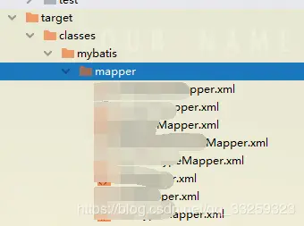
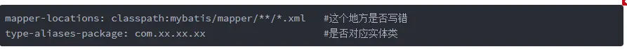
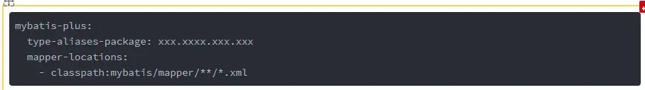

# Invalid bound statement (not found)错误的可能原因

这个问题我相信很多和我一样的小煞笔会遇见

Invalid bound statement (not found)这个问题的实质就是mapper接口和mapper.xml没有映射起来

常见的低智商问题有下列几个

**1.mapper.xml 里面的 namespace与实际类不一样**

这个有个快捷的检测办法就是按住ctrl键，然后点击namespace里面的包名，如果能跳到对应的类，那就说明没得问题，如果你用的IDEA也是同样的办法，IDEA的包名是可以分段的，只能能点进去都没问题。

**2.mapper接口的函数名称和mapper.xml里面的标签id不一致**

这个问题也很常见，最好的办法还是复制过去，这样可以确保没得问题,1点和2点都是关于拼写错误的情况

**3.构建没有进去，请看一下target文件夹下面这些是否存在，没有请重新构建**

**4.扫包是否添加，我的是添加在springboot启动类上面的，如果是配置类请百度一下**

**5.配置文件写错**

如果你是Mybatis的话请注意yml或者properties文件里面的

如果你是Mybatis plus 这个时候你要注意了，mybatis plus是下面这样的配置,如果你发现1,2,3,4点的问题都没有问题，你需要注意一下这个东西

