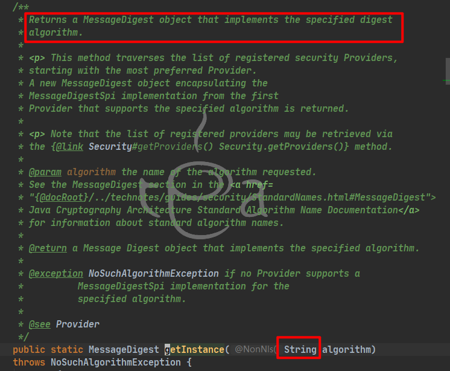
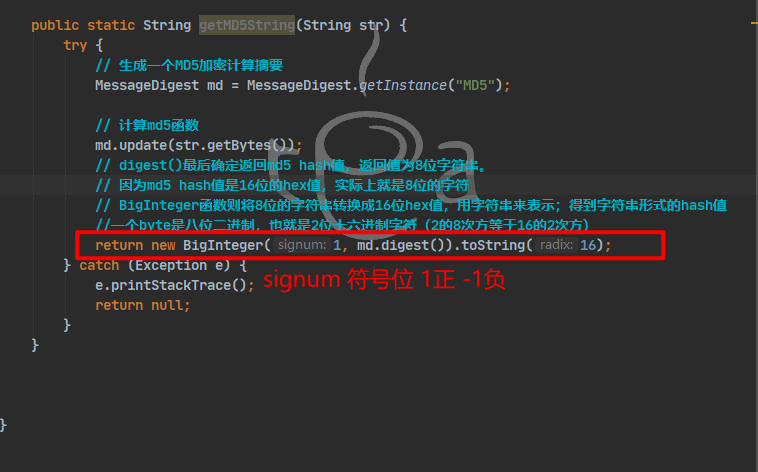
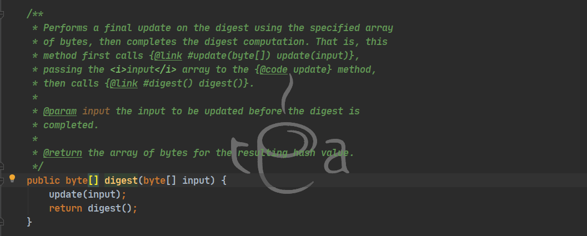
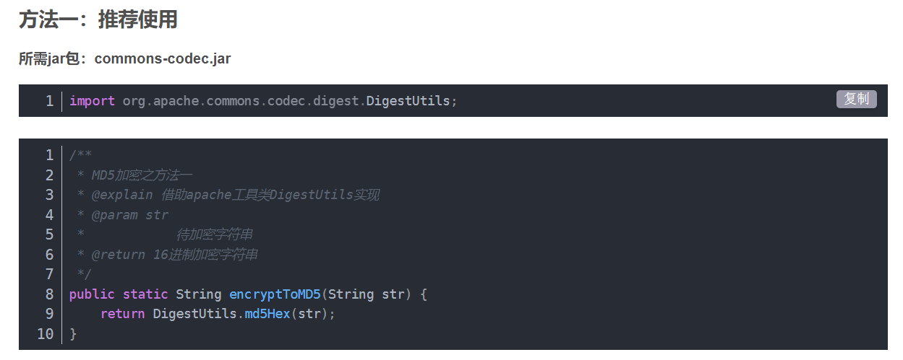

# MD5

> Message-Digest Algorithm 5 信息摘要算法
>
> * 不可逆
> * 高度离散 无规律可循
> * 压缩性  任意长度的数据 算出md5值长度固定
> * 弱碰撞性 

###### **java实现MD5加密的方法**


方法一：java中提供MessageDigest类

> 摘要算法（Digest）也成为哈希算法、散列算法，可以将任意长度的数据转换成定长、不可逆的数字
>
> MD5生成128位的（16字节）的散列值  SHA-1 160位（20字节）

1. ###### 创建MessageDigest对象

* 通过GetInstance方法 传入算法名称 获得运用了改算法的实例



2. ###### 将数据传递给创建的MessageDigest对象

   创建消息摘要对象后，需要将消息/数据传递给它。 

   您可以使用**MessageDigest**类的**update()**方法执行此操作，此方法接受表示消息的字节数组，并将其添加/传递给上面创建的MessageDigest对象。

```java
	md.update(msg.getBytes());
```

3. ###### 生成消息摘要

   您可以使用digest()方法生成消息摘要，MessageDigest类此方法计算当前对象的散列函数，并以字节数组的形式返回消息摘要。

   使用摘要方法生成消息摘要。

   ```java
   byte[] digest = md.digest();
   ```

   

   ```java
   此处亦可以改用
       return ByteUtils.toHexString(md.digest(str.getBytes("utf-8")));
   ```

   > **此处的 update似乎不需要**
   >
   > 
   >
   > 直接调用digest方法 内部会自行调用update


方法二：在第一种的基础上添加一些干扰

> 大致思路：把密码根据指定的编码方式（UTF-8之类）转化成ByteArray 然后处理成hexString（十六进制字符）

```java
package com.mmall.util;

import java.security.MessageDigest;

/**
 * Created by dt
 */
public class MD5Util {

　　//这里主要是遍历8个byte，转化为16位进制的字符，即0-F
    private static String byteArrayToHexString(byte b[]) {
        StringBuffer resultSb = new StringBuffer();
        for (int i = 0; i < b.length; i++)
            resultSb.append(byteToHexString(b[i]));

        return resultSb.toString();
    }
　　//这里是针对单个byte，256的byte通过16拆分为d1和d2
    private static String byteToHexString(byte b) {
        int n = b;
        if (n < 0)
            n += 256;
        int d1 = n / 16;
        int d2 = n % 16;
        return hexDigits[d1] + hexDigits[d2];
    }

    /**
     * 返回大写MD5
     *
     * @param origin
     * @param charsetname
     * @return
     */
    private static String MD5Encode(String origin, String charsetname) {
        String resultString = null;
        try {
            resultString = new String(origin);
            MessageDigest md = MessageDigest.getInstance("MD5");
            if (charsetname == null || "".equals(charsetname))
                resultString = byteArrayToHexString(md.digest(resultString.getBytes()));
            else
                resultString = byteArrayToHexString(md.digest(resultString.getBytes(charsetname)));
        } catch (Exception exception) {
        }
        return resultString.toUpperCase();
    }

    public static String MD5EncodeUtf8(String origin) {
        origin = origin + PropertiesUtil.getProperty("password.salt", "");
        return MD5Encode(origin, "utf-8");
    }


    private static final String hexDigits[] = {"0", "1", "2", "3", "4", "5",
            "6", "7", "8", "9", "a", "b", "c", "d", "e", "f"};

}

//在这段代码里面还引入了PropertiesUtil.getProperty("password.salt","")来获取一个额外的字符串，以保证碰撞算法的命中率更低，且在第三方MD5平台上也很难被搜索到。
password.salt = 23543dfggeelysdafaqj23ou89ZXcj@#$@#$#@KJdjklj;D../dSF.,
```


方法三：Spring核心包

```java
/**
 * MD5加密之方法三
 * @explain springboot自带MD5加密
 * @param str
 *            待加密字符串
 * @return 16进制加密字符串
 */
 public static String encrypt3ToMD5(String str) {
 	log.debug("MD5待加密字符串：\n"+str);
 	String md5 = "  ";
 	try {
 	md5 = DigestUtils.md5DigestAsHex(text.getBytes("utf-8"))
    } catch (UnsupportedEncodingException e) {
    e.printStackTrace();
    }
    log.degbug("MD5加密结果：\n"+md5)
    return md5;
 }

```

方法四：使用common-codec 包



确实有够简单的哈。

莫名的挫败感，前面的方法看了半天。