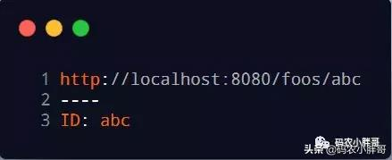

# @requestparam map 接收前端的值_Spring MVC中@RequestParam注解的使用指南

# **概述**

学java的同学们大家好，在这个教程中，码农小胖哥将带大家来研究一下Spring的@RequestParam注解。简而言之，我们可以使用@RequestParam从请求中提取查询参数，[表单](https://so.csdn.net/so/search?q=表单&spm=1001.2101.3001.7020)参数甚至文件。我们将讨论如何使用@RequestParam及其属性。我们还将讨论@RequestParam和@PathVariable之间的区别。

简单映射

假设我们有一个端点/ [api](https://so.csdn.net/so/search?q=api&spm=1001.2101.3001.7020) / foos，它接受一个名为id的查询参数：

在此示例中，我们使用 @RequestParam来提取id查询参数。一个简单的GET请求将调用getFoos：

接下来，让我们看一下注释的属性：**name， value，required和defaultValue**。

# **指定请求参数名称**

在前面的示例中，变量名称和参数名称都相同。但有时我们希望这些不同。或者，如果我们不使用Spring Boot，我们可能需要进行特殊的编译时配置，否则参数名称实际上不会在编译后的字节码中。**为此我们可以通过name属性配置 @RequestParam名称**：

@RequestParam(value =“id”)等同于 @RequestParam(“id”)。

# **可选的请求参数**

默认情况下，需要使用@RequestParam注释的方法参数 。这意味着如果请求中不存在该参数，我们将收到错误：

我们可以将@RequestParam的required设置为false ，默认为true(必选)：

我们测试带参数和不带参数的情况：

这样方法如果未指定参数，则将method参数绑定为null，不会出现异常。

# **请求参数的默认值**

我们还可以 使用defaultValue属性为@RequestParam设置默认值：

**类似required = false， 当不提供参数时注入默认参数**：

**当我们提供时，注入提供的参数值：**

**请注意，当我们设置 defaultValue 属性时， required确实设置为false。**

# **映射所有参数**

对于复杂参数同样可以做到映射，前端传入参数以 k=v 形式进行传递，后端将自动注入。以下以Map为例：

请求结果为：

# 

# **映射多值参数**

单个@RequestParam可以传递多个值比如数组或者结合：

Spring [MVC](https://so.csdn.net/so/search?q=MVC&spm=1001.2101.3001.7020)将映射逗号分隔的 id 参数：

或者单独的id参数列表：

接下来我们将对比@RequestParam 和 @PathVariable之间的异同。

# **前提概要**

当@RequestParam从查询字符串中提取值时，@ PathVariables从URI路径中提取值：

根据路径进行映射出的结果：

对于@RequestParam，它将是：

跟@ PathVariables相同的响应，只是一个不同的URI：

# **URI编码**

RFC3986文档规定，Url中只允许包含英文字母(a-zA-Z)、数字(0-9)、-_.~4个特殊字符以及所有保留字符。US-ASCII字符集中没有对应的可打印字符：Url中只允许使用可打印字符。US-ASCII码中的10-7F字节全都表示控制字符，这些字符都不能直接出现在Url中。同时，对于80-FF字节(ISO-8859-1)，由于已经超出了US-ACII定义的字节范围，因此也不可以放在Url中。

保留字符：Url可以划分成若干个组件，协议、主机、路径等。有一些字符(:/?#[]@)是用作分隔不同组件的。例如：冒号用于分隔协议和主机，/用于分隔主机和路径，?用于分隔路径和查询参数，等等。还有一些字符(!$&’()*+,;=)用于在每个组件中起到分隔作用的，如=用于表示查询参数中的键值对，&符号用于分隔查询多个键值对。当组件中的普通数据包含这些特殊字符时，需要对其进行编码。RFC3986中指定了以下字符为保留字符：! * ’ ( ) ; : @ & = + $ , / ? # [ ]

# **两种注解的编码问题**

我们可以根据上两种注解来分别执行两个示例。

@RequestParam示例结果：

@PathVariable示例结果：

根据上面两种结果，@PathVariable 从路径中获取是不用编码解码的，而@RequestParam会进行编码解码。这种特性很少有人注意到，所以我需要特别指出来

# **可选值**

我们可以使用从**Spring 4.3.3**开始的必需属性使@PathVariable成为可选：

然后我们对该接口可以同时进行下面的操作：

或者：

对于@RequestParam，我们也可以通过设置required属性进行实现类似的效果。但是请注意，**在使@PathVariable成为可选时我们应该小心，以避免路径冲突。**